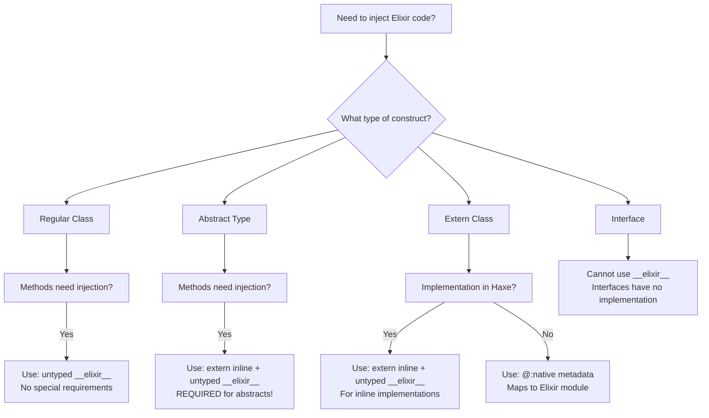

# Complete Guide to `__elixir__` Code Injection in Reflaxe.Elixir

## Executive Summary

This guide comprehensively documents when and how to use `untyped __elixir__()` code injection across different Haxe constructs. Written after extensive debugging of abstract type compilation issues to prevent future time waste.

## Table of Contents
1. [The Fundamental Problem](#the-fundamental-problem)
2. [Decision Tree](#decision-tree)
3. [Scenario Comparison Table](#scenario-comparison-table)
4. [Detailed Scenarios](#detailed-scenarios)
5. [Common Pitfalls](#common-pitfalls)
6. [Migration Guide](#migration-guide)

## The Fundamental Problem

### When `__elixir__` Exists
- **After Reflaxe initialization**: The identifier `__elixir__` is injected by Reflaxe through `targetCodeInjectionName`
- **During compilation to Elixir**: Available when actually transpiling to Elixir
- **NOT during Haxe typing**: Doesn't exist when Haxe is type-checking your code

### The Compilation Timeline
```
1. Haxe reads files → 2. Haxe types code → 3. Reflaxe inits → 4. Reflaxe compiles
                          ↑                        ↑
                    __elixir__ MISSING        __elixir__ EXISTS
```

## Decision Tree



## Scenario Comparison Table

| Construct Type | `__elixir__` Support | Required Modifiers | When to Use | Example |
|----------------|---------------------|-------------------|-------------|---------|
| **Regular Class** | ✅ Direct use | None | Standard implementations | `Std.hx` |
| **Regular Class (static)** | ✅ Direct use | None | Utility functions | `StringTools.hx` |
| **Abstract Type** | ⚠️ With `extern inline` | `extern inline` | Type-safe wrappers | `LiveSocket.hx` |
| **Extern Class** | ⚠️ With `extern inline` | `extern inline` | Inline implementations | `NativeString.hx` |
| **Extern Class (@:native)** | ❌ Not needed | `@:native` | Direct module mapping | `Phoenix.hx` |
| **Interface** | ❌ Not supported | N/A | Contracts only | N/A |
| **@:coreApi Class** | ✅ Special treatment | `@:coreApi` | Core stdlib | `Array.hx` |

## Detailed Scenarios

### 1. Regular Classes - Direct Usage ✅

**When to use**: Standard Haxe classes that compile to Elixir modules

```haxe
// ✅ WORKS: Regular class methods can use __elixir__ directly
class StringUtils {
    public static function toElixirAtom(str: String): Dynamic {
        return untyped __elixir__('String.to_atom({0})', str);
    }
}
```

**Why it works**: Regular class methods aren't typed until needed, after Reflaxe initialization.

### 2. Abstract Types - Requires `extern inline` ⚠️

**When to use**: Type-safe wrappers around dynamic Elixir values

```haxe
// ❌ FAILS: Abstract methods are typed early
abstract Socket<T>(Dynamic) {
    public function clearFlash(): Socket<T> {
        return untyped __elixir__('Phoenix.LiveView.clear_flash({0})', this);
    }
}

// ✅ WORKS: extern inline delays typing until usage
abstract Socket<T>(Dynamic) {
    extern inline public function clearFlash(): Socket<T> {
        return untyped __elixir__('Phoenix.LiveView.clear_flash({0})', this);
    }
}
```

**Why `extern inline` is required**: 
- Abstract methods are essentially always inline
- They get typed when the abstract is imported
- `extern inline` delays body typing until actual usage

### 3. Pure Extern Classes - Use @:native ✅

**When to use**: Mapping to existing Elixir modules without implementation

```haxe
// ✅ BEST: Use @:native for pure extern mapping
@:native("Phoenix.LiveView")
extern class LiveView {
    @:native("clear_flash")
    static function clearFlash<T>(socket: Socket<T>): Socket<T>;
}
```

**Why this is preferred**: No implementation needed, direct module mapping.

### 4. Extern Classes with Inline Implementation ⚠️

**When to use**: Extern classes that need inline Haxe implementations

```haxe
// ✅ WORKS: extern inline for implementation in extern class
@:cxxStd
extern class NativeString {
    public static extern inline function nullTerminator(): String {
        return untyped __cpp__("\"\\0\"");  // Or __elixir__ for our case
    }
}
```

**Note**: Similar to abstract types, requires `extern inline`.

### 5. Classes with @:coreApi - Special Treatment ✅

**When to use**: Core standard library classes

```haxe
// ✅ WORKS: @:coreApi gives special compilation treatment
@:coreApi
class Array<T> {
    public function map<S>(f: T -> S): Array<S> {
        return untyped __elixir__("Enum.map({0}, {1})", this, f);
    }
}
```

**Why it works**: `@:coreApi` classes get special handling during compilation.

## Common Pitfalls

### ❌ Pitfall 1: Using `inline` without `extern`
```haxe
// ❌ FAILS: inline alone doesn't help
abstract MyType(Dynamic) {
    inline public function method(): MyType {
        return untyped __elixir__(...);  // Still fails!
    }
}
```

### ❌ Pitfall 2: Forgetting Abstract Methods are Special
```haxe
// ❌ FAILS: Assuming abstracts work like classes
abstract MyType(Dynamic) {
    public function method(): MyType {  // No extern inline!
        return untyped __elixir__(...);  // "Unknown identifier"
    }
}
```

### ❌ Pitfall 3: Using __elixir__ in Interfaces
```haxe
// ❌ FAILS: Interfaces have no implementation
interface IMyInterface {
    function method(): Void {
        untyped __elixir__(...);  // Interfaces can't have bodies!
    }
}
```

## Migration Guide

### From Direct Extern Calls to __elixir__
```haxe
// Before (fails with eval target):
Phoenix.LiveView.clearFlash(socket);

// After (works everywhere):
extern inline public function clearFlash(): Socket<T> {
    return untyped __elixir__('Phoenix.LiveView.clear_flash({0})', this);
}
```

### From Regular to Abstract Type
```haxe
// If converting a regular class to abstract:
// 1. Add `extern inline` to ALL methods using __elixir__
// 2. Test compilation immediately
// 3. Document the requirement
```

## Best Practices Summary

1. **Regular Classes**: Use `untyped __elixir__()` directly - no special requirements
2. **Abstract Types**: ALWAYS use `extern inline` for methods with `__elixir__`
3. **Pure Externs**: Prefer `@:native` metadata over `__elixir__` implementation
4. **Inline Externs**: Use `extern inline` like with abstracts
5. **Document Usage**: Always document why you chose a specific approach

## Related Documentation

- [`/std/phoenix/LiveSocket.hx`](/std/phoenix/LiveSocket.hx) - Abstract type with `extern inline` (working example)
- [`/std/Array.hx`](/std/Array.hx) - @:coreApi class with direct `__elixir__` usage
- [`/std/phoenix/Phoenix.hx`](/std/phoenix/Phoenix.hx) - Pure extern with @:native
- [`/CLAUDE.md`](/CLAUDE.md#critical-abstract-types-require-extern-inline-for-__elixir__-injection) - Critical lesson learned

## Conclusion

The key insight: **Abstract type methods are typed early, before `__elixir__` exists**. The solution is `extern inline` which delays typing until usage, after Reflaxe initialization. This guide documents all scenarios to prevent future debugging circles.

Remember: When in doubt, check this guide's decision tree first!