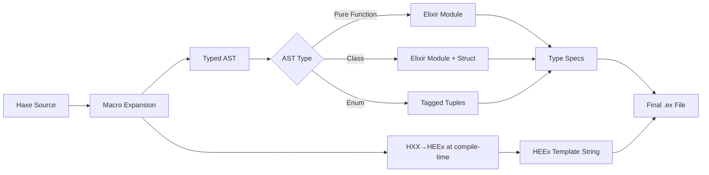

# Product Requirements Document: Haxe→Elixir Compiler

## Executive Summary

**Project Name**: Reflaxe.Elixir  
**Version**: 1.0.0  
**Purpose**: A Haxe compilation target for Elixir/BEAM that enables gradual typing of Phoenix applications  
**Target Users**: Teams wanting type safety in Elixir projects without losing Phoenix/OTP features  
**Unique Value**: 
- First solution to provide **compile-time type-safe Ecto queries** through macro validation
- **Elixir-like syntax** in Haxe through @:module macros and pipe operators
- **Zero learning curve** for Elixir developers with familiar patterns

## 1. Goals & Non-Goals

### Goals
- ✅ Compile Haxe to readable, idiomatic Elixir code
- ✅ Generate Elixir typespecs from Haxe types
- ✅ Support gradual migration of existing Phoenix apps
- ✅ Type-safe Phoenix contexts and business logic
- ✅ **Type-safe Ecto queries via compile-time macros**
- ✅ HXX→HEEx template compilation for LiveView
- ✅ Preserve Phoenix conventions and patterns
- ✅ Support GenServer/OTP abstractions
- ✅ Enable code sharing between JS and BEAM targets
- ✅ **Enforce type safety throughout** (minimize Any/Dynamic usage)

### Non-Goals
- ❌ Replace Phoenix framework
- ❌ Support all Haxe standard library (only functional subset)
- ❌ Runtime type checking (compile-time only)
- ❌ Hot code reloading for Haxe modules
- ❌ Macro system compatibility (Elixir macros stay in Elixir)
- ❌ **Allow pervasive Dynamic typing** (defeats the purpose)

## 2. Technical Architecture

### HXX Processing Model

HXX (Haxe's JSX-like syntax) is processed entirely at compile-time through Haxe macros:

1. **Macro Expansion Phase**: HXX syntax is parsed and transformed to HEEx strings
2. **Type Checking**: Template bindings are validated against types
3. **Code Generation**: HEEx strings are embedded as literals in generated Elixir

This means:
- ✅ Zero runtime overhead (all transformation at compile-time)
- ✅ Type safety for template bindings
- ✅ No additional dependencies (no Node.js, just Haxe macros)
- ✅ Generated Elixir contains plain HEEx strings

### Ecto Query Type System

Using Haxe macros, Ecto queries are type-checked at compile time:

1. **Schema Analysis**: Extract field types from schema definitions
2. **Query Validation**: Validate field access, joins, and conditions at compile time
3. **Code Generation**: Generate standard Ecto query syntax

Benefits:
- ✅ Compile-time validation of all queries
- ✅ IDE autocomplete for schema fields
- ✅ Refactoring safety (rename fields, queries update)
- ✅ No runtime performance impact

### 2.1 Compiler Structure

```
reflaxe.elixir/
├── src/
│   ├── ElixirCompiler.hx         # Main compiler class
│   ├── ElixirPrinter.hx          # AST→Elixir string generation
│   ├── ElixirTyper.hx            # Type→Typespec mapping
│   ├── PhoenixMapper.hx          # Phoenix-specific transformations
│   └── OTPAbstractions.hx        # GenServer/Supervisor mappings
├── src/macro/
│   ├── HXXMacro.hx              # Compile-time HXX→HEEx transformation
│   └── HXXParser.hx             # JSX syntax parser for macros
├── std/
│   └── elixir/                   # Elixir standard library externs
│       ├── Enum.hx
│       ├── Map.hx
│       ├── List.hx
│       ├── GenServer.hx
│       └── Phoenix.hx
└── haxelib.json
```

### 2.2 Compilation Pipeline



**Key Point**: HXX transformation happens during macro expansion, before the main compilation. The JSX-like syntax is converted to HEEx strings at compile-time, not runtime.

## 3. Core Features

### 3.0 Elixir Interop (Gradual Adoption)

#### Extern Definitions for Existing Elixir Code

The compiler supports extern definitions to call existing Elixir modules from Haxe:

```haxe
// externs/Phoenix.hx - Declare existing Phoenix modules
package phoenix;

@:native("Phoenix.Controller")
extern class Controller {
  static function json(conn: Dynamic, data: Dynamic): Dynamic;
  static function render(conn: Dynamic, template: String, assigns: Dynamic): Dynamic;
  static function redirect(conn: Dynamic, to: String): Dynamic;
}

@:native("Phoenix.LiveView")
extern class LiveView {
  static function assign(socket: Socket, key: String, value: Dynamic): Socket;
  static function push_event(socket: Socket, event: String, payload: Dynamic): Socket;
}
```

```haxe
// externs/MyAppElixir.hx - Your existing Elixir modules
package myapp.legacy;

@:native("MyApp.LegacyModule")
extern class LegacyModule {
  static function complexBusinessLogic(data: BusinessData): ProcessedData;
  static function existingValidation(user: UserData): Bool;
}

@:native("MyApp.Mailer")
extern class Mailer {
  static function deliver(email: Email): DeliveryResult;
}

// Type definitions for extern parameters
typedef BusinessData = {
  customerId: Int,
  orderItems: Array<OrderItem>,
  discountCode: Null<String>
}

typedef ProcessedData = {
  finalPrice: Float,
  appliedDiscounts: Array<String>,
  taxAmount: Float
}

typedef UserData = {
  email: String,
  age: Int,
  country: String
}

typedef Email = {
  to: String,
  from: String,
  subject: String,
  body: EmailBody
}

typedef EmailBody = Html(String) | Text(String);

typedef DeliveryResult = {
  messageId: String,
  status: DeliveryStatus
}
```

#### Using Externs in Haxe Code
```haxe
// src_haxe/MyApp/Accounts.hx
import myapp.legacy.LegacyModule;
import phoenix.Controller;

class Accounts {
  public static function createUser(params: UserParams): Result<User> {
    // Call existing Elixir validation (typed extern)
    if (!LegacyModule.existingValidation(params)) {
      return Error("Validation failed");
    }
    
    // Use existing Elixir business logic (typed return)
    var processed: ProcessedUser = LegacyModule.complexBusinessLogic(params);
    
    // New typed code
    var user = new User(processed.id, processed.email, processed.name);
    return Ok(user);
  }
}

// Typed parameters instead of Dynamic
typedef UserParams = {
  email: String,
  password: String,
  name: String,
  ?age: Int
}

typedef ProcessedUser = {
  id: Int,
  email: String,
  name: String,
  hashedPassword: String
}
```

#### Auto-Generated Externs from Existing Code

The compiler can scan existing Elixir modules and generate extern definitions:

```bash
# Generate externs for existing Phoenix app
haxe --run ElixirExternGenerator \
  --input lib/my_app \
  --output externs/generated \
  --include-specs true
```

Generated extern:
```haxe
// externs/generated/MyApp_Orders.hx
package myapp;

/**
 * Auto-generated extern for MyApp.Orders
 * Source: lib/my_app/orders.ex
 */
@:native("MyApp.Orders")
extern class Orders {
  @:native("list_orders")
  static function listOrders(): Array<Order>;
  
  @:native("get_order!")
  static function getOrder(id: Int): Order;
  
  @:native("create_order")
  static function createOrder(attrs: OrderAttrs): Result<Order, ChangesetErrors>;
  
  @:native("update_order")
  static function updateOrder(order: Order, attrs: OrderAttrs): Result<Order, ChangesetErrors>;
}

// Generated from @type annotations in Elixir
typedef Order = {
  id: Int,
  userId: Int,
  items: Array<OrderItem>,
  total: Float,
  status: OrderStatus
}

typedef OrderItem = {
  productId: Int,
  quantity: Int,
  price: Float
}

typedef OrderAttrs = {
  ?userId: Int,
  ?items: Array<OrderItem>,
  ?status: OrderStatus
}

enum abstract OrderStatus(String) {
  var Pending = "pending";
  var Paid = "paid";
  var Shipped = "shipped";
  var Delivered = "delivered";
}
```

#### Mixed Module Pattern

Support for partially typed modules where some functions are in Elixir, others in Haxe:

```haxe
// src_haxe/MyApp/Accounts.hx
package myapp;

@:elixir.partial("MyApp.Accounts")
class Accounts {
  // This function will be generated
  public static function calculateUserScore(user: User): Float {
    return user.purchases.length * 10 + user.referrals * 50;
  }
  
  // This function exists in Elixir - just declare as extern
  @:extern
  public static function sendWelcomeEmail(user: User): Result<EmailStatus>;
  
  // This calls the existing Elixir function
  public static function onboardUser(data: UserOnboardingData): Result<User> {
    var user = createUser(data); // Typed function
    sendWelcomeEmail(user);      // Existing Elixir function
    return user;
  }
}

// Typed data structures
typedef UserOnboardingData = {
  email: String,
  password: String,
  firstName: String,
  lastName: String,
  ?referralCode: String
}

typedef EmailStatus = {
  messageId: String,
  status: DeliveryStatus
}

enum abstract DeliveryStatus(String) {
  var Sent = "sent";
  var Queued = "queued";
  var Failed = "failed";
}
```

This generates:
```elixir
# lib/my_app/accounts.generated.ex
defmodule MyApp.Accounts.Generated do
  @spec calculate_user_score(User.t()) :: float()
  def calculate_user_score(user) do
    length(user.purchases) * 10 + user.referrals * 50
  end
  
  @spec onboard_user(map()) :: {:ok, User.t()} | {:error, String.t()}
  def onboard_user(data) do
    user = MyApp.Accounts.create_user(data)
    MyApp.Accounts.send_welcome_email(user)
    user
  end
end
```

#### Calling Haxe from Elixir

The generated Elixir code is just normal Elixir modules, so existing code can call it:

```elixir
# Existing Elixir controller
defmodule MyAppWeb.UserController do
  use MyAppWeb, :controller
  
  def create(conn, params) do
    # Call Haxe-generated function from Elixir
    case MyApp.Accounts.Generated.onboard_user(params) do
      {:ok, user} -> 
        conn |> put_flash(:info, "Welcome!") |> redirect(to: "/")
      {:error, msg} -> 
        conn |> put_flash(:error, msg) |> render("new.html")
    end
  end
end
```

#### Type Information Preservation

When importing Elixir modules with @spec annotations, attempt to parse and use them:

```elixir
# Existing Elixir with specs
defmodule MyApp.Analytics do
  @spec track_event(String.t(), map()) :: :ok | {:error, String.t()}
  def track_event(event_name, properties) do
    # Implementation
  end
  
  @spec get_metrics(Date.t(), Date.t()) :: %{
    visits: integer(),
    unique_users: integer(),
    page_views: integer()
  }
  def get_metrics(start_date, end_date) do
    # Implementation
  end
end
```

Auto-generated extern with types:
```haxe
@:native("MyApp.Analytics")
extern class Analytics {
  @:native("track_event")
  static function trackEvent(eventName: String, properties: EventProperties): Result<Void, String>;
  
  @:native("get_metrics")
  static function getMetrics(startDate: Date, endDate: Date): Metrics;
}

// Types inferred from Elixir @spec
typedef EventProperties = Map<String, Any>;

typedef Metrics = {
  visits: Int,
  uniqueUsers: Int,
  pageViews: Int
}
```

#### Configuration for Interop

```hxml
# build.hxml
-cp src_haxe
-cp externs          # External Elixir definitions
-lib reflaxe.elixir

# Interop settings
-D elixir-extern-path=externs
-D elixir-generate-externs=true
-D elixir-scan-specs=true
-D elixir-merge-modules=true  # Merge generated with existing
```

### 3.1 Type Mapping

| Haxe Type | Elixir Type | Typespec | Notes |
|-----------|-------------|----------|--------|
| `Int` | `integer` | `integer()` | |
| `Float` | `float` | `float()` | |
| `Bool` | `boolean` | `boolean()` | |
| `String` | `binary` | `String.t()` | UTF-8 |
| `Array<T>` | `list` | `list(t)` | |
| `Map<K,V>` | `map` | `%{k => v}` | |
| `haxe.ds.StringMap<V>` | `map` | `%{String.t() => v}` | |
| `Null<T>` | `t \| nil` | `t \| nil` | |
| `Any` | `any` | `any()` | Use sparingly |
| `haxe.DynamicAccess<T>` | `map` | `%{String.t() => t}` | For dynamic keys |
| Enum | Tagged tuple | `{atom(), ...}` | |
| Class (final fields) | Map/Struct | `%ModuleName{}` | |
| Interface | Behaviour | `@behaviour` | |
| Function | Function | `(... -> ...)` | |
| Abstract Enum | Atom | `atom()` | For string enums |

#### Type Safety Guidelines

**Avoid `Dynamic` and `Any`**: These defeat the purpose of type safety. Instead:

```haxe
// ❌ Bad: Using Dynamic
function processData(data: Dynamic): Dynamic {
  return data.someField;
}

// ✅ Good: Define proper types
typedef UserData = {
  id: Int,
  name: String,
  email: String
}

function processData(data: UserData): String {
  return data.name;
}

// ✅ Good: For truly dynamic maps, use DynamicAccess
function processConfig(config: haxe.DynamicAccess<String>): String {
  return config.get("api_key") ?? "default";
}

// ✅ Good: For variable types, use generics
function processAny<T>(data: T, processor: T->String): String {
  return processor(data);
}
```

**When `Any` is Acceptable**:
- Interfacing with JavaScript libraries
- JSON parsing before validation
- Legacy code migration (temporarily)
- Truly polymorphic operations

Always prefer specific types or generics over `Any`/`Dynamic`.

**Handling JSON and External Data**:

```haxe
// For JSON parsing, validate immediately
class JsonParser {
  // Entry point can accept Any for raw JSON
  public static function parseUser(json: Any): Result<User> {
    // Immediately validate and convert to typed structure
    return try {
      var obj = cast(json, haxe.DynamicAccess<Any>);
      Ok({
        id: cast(obj.get("id"), Int),
        name: cast(obj.get("name"), String),
        email: cast(obj.get("email"), String)
      });
    } catch (e: Any) {
      Error("Invalid JSON structure: " + e);
    }
  }
  
  // All other functions work with typed data
  public static function processUser(user: User): ProcessedUser {
    // Type safe from here on
    return {
      id: user.id,
      displayName: user.name.toUpperCase(),
      domain: user.email.split("@")[1]
    };
  }
}
```

### 3.2 File Generation Strategy

#### Input Structure (Haxe)
```
my_app/
├── src_haxe/
│   ├── MyApp.hx                  # Main app module
│   ├── MyApp/
│   │   ├── Accounts.hx           # Context (pure functions)
│   │   ├── Accounts/
│   │   │   └── User.hx           # Domain model
│   │   └── Repo.hx               # Database functions
│   └── MyAppWeb/
│       ├── UserLive.hx           # LiveView logic with inline HXX
│       └── ProductLive.hx        # LiveView using HXX macro
└── build.hxml                     # Haxe build config
```

Note: HXX templates are written inline using the `hxx` macro, not as separate files. The JSX-like syntax is processed at compile-time by Haxe macros.

#### Output Structure (Elixir)
```
my_app/
├── lib/
│   ├── my_app/
│   │   ├── accounts.ex           # Generated context
│   │   ├── accounts/
│   │   │   └── user.ex           # Generated schema
│   │   └── repo.ex               # Generated repo functions
│   └── my_app_web/
│       └── live/
│           ├── user_live.ex      # Generated LiveView
│           └── user_live.html.heex # Generated template
```

### 3.3 Module Compilation Rules

#### Pure Module
```haxe
// Input: src_haxe/MyApp/Math.hx
package myapp;

class Math {
  public static function factorial(n: Int): Int {
    return n <= 1 ? 1 : n * factorial(n - 1);
  }
  
  public static function isPrime(n: Int): Bool {
    if (n < 2) return false;
    for (i in 2...Math.ceil(Math.sqrt(n))) {
      if (n % i == 0) return false;
    }
    return true;
  }
}
```

```elixir
# Output: lib/my_app/math.ex
defmodule MyApp.Math do
  @moduledoc """
  Generated from Haxe - Version: 1.0.0
  Source: src_haxe/MyApp/Math.hx
  """
  
  @spec factorial(integer()) :: integer()
  def factorial(n) when n <= 1, do: 1
  def factorial(n), do: n * factorial(n - 1)
  
  @spec is_prime(integer()) :: boolean()
  def is_prime(n) when n < 2, do: false
  def is_prime(n) do
    limit = :math.sqrt(n) |> :math.ceil() |> round()
    Enum.all?(2..(limit - 1), fn i -> rem(n, i) != 0 end)
  end
end
```

#### Data Structure (Immutable Class)
```haxe
// Input: src_haxe/MyApp/Accounts/User.hx
package myapp.accounts;

@:struct
class User {
  public final id: Int;
  public final email: String;
  public final name: String;
  public final age: Int;
  
  public function new(id: Int, email: String, name: String, age: Int) {
    this.id = id;
    this.email = email;
    this.name = name;
    this.age = age;
  }
  
  public function isAdult(): Bool {
    return age >= 18;
  }
  
  public function withName(newName: String): User {
    return new User(id, email, newName, age);
  }
}
```

```elixir
# Output: lib/my_app/accounts/user.ex
defmodule MyApp.Accounts.User do
  @type t :: %__MODULE__{
    id: integer(),
    email: String.t(),
    name: String.t(),
    age: integer()
  }
  
  defstruct [:id, :email, :name, :age]
  
  @spec new(integer(), String.t(), String.t(), integer()) :: t()
  def new(id, email, name, age) do
    %__MODULE__{
      id: id,
      email: email,
      name: name,
      age: age
    }
  end
  
  @spec is_adult(t()) :: boolean()
  def is_adult(%__MODULE__{age: age}) do
    age >= 18
  end
  
  @spec with_name(t(), String.t()) :: t()
  def with_name(%__MODULE__{} = user, new_name) do
    %{user | name: new_name}
  end
end
```

#### Algebraic Data Type (Enum)
```haxe
// Input: src_haxe/MyApp/Types.hx
package myapp;

enum Result<T> {
  Ok(value: T);
  Error(message: String);
}

enum Filter {
  All;
  Active;
  Completed;
  ByTag(tag: String);
}
```

```elixir
# Output: lib/my_app/types.ex
defmodule MyApp.Types do
  @type result(t) :: {:ok, t} | {:error, String.t()}
  
  @type filter :: 
    :all | 
    :active | 
    :completed | 
    {:by_tag, String.t()}
end
```

### 3.4 Phoenix Integration

#### Context Module (Idiomatic Syntax)
```haxe
// Input: src_haxe/MyApp/Accounts.hx
@:module MyApp.Accounts;
using ecto.Query;

// Import functions feel like Elixir imports
import MyApp.Accounts.User;

// No more public static everywhere!
@:ecto.repo(User)
function getUser(id: Int): Null<User>;

@:ecto.repo(User)  
function listUsers(): Array<User>;

function createUser(attrs: UserAttrs): Result<User> {
  return validateUser(attrs) |> saveUser;
}

// Pattern matching for error handling
function updateUser(id: Int, attrs: UserAttrs): Result<User> {
  return switch getUser(id) {
    case null: Error("User not found");
    case user: 
      user
        |> applyChanges(attrs)
        |> validateUser
        |> saveUser;
  }
}

// Private function with metadata
@:private
function validateUser(attrs: UserAttrs): Result<User> {
  // Validation logic
}

// Pipe-friendly functions
function withEmail(email: String): UserAttrs -> UserAttrs {
  return (attrs) -> {...attrs, email: email};
}

// Type definitions stay the same
typedef UserAttrs = {
  email: String,
  name: String,
  ?age: Int,
  ?role: UserRole
}

enum UserRole {
  Admin;
  User;
  Guest;
}
```

```elixir
# Output: lib/my_app/accounts.ex
defmodule MyApp.Accounts do
  alias MyApp.Repo
  alias MyApp.Accounts.User
  
  @spec get_user(integer()) :: User.t() | nil
  def get_user(id) do
    Repo.get(User, id)
  end
  
  @spec list_users() :: list(User.t())
  def list_users do
    Repo.all(User)
  end
  
  @spec create_user(map()) :: {:ok, User.t()} | {:error, String.t()}
  def create_user(attrs) do
    case validate_user(attrs) do
      {:ok, user} -> {:ok, save_user(user)}
      {:error, e} -> {:error, e}
    end
  end
  
  defp validate_user(attrs) do
    %User{}
    |> User.changeset(attrs)
    |> Repo.insert()
  end
end
```

#### LiveView Module
```haxe
// Input: src_haxe/MyAppWeb/UserLive.hx
package myappweb;

import phoenix.LiveView;
import myapp.accounts.User;
import myapp.Accounts;
import HXXMacro.hxx;  // Import the macro

@:liveview
class UserLive extends LiveView {
  typedef Assigns = {
    users: Array<User>,
    loading: Bool,
    filter: String
  }
  
  typedef Params = {
    ?id: String,
    ?page: Int
  }
  
  typedef Session = {
    userId: Int,
    token: String
  }
  
  public function mount(params: Params, session: Session, socket: Socket<Assigns>): MountResult {
    return if (connected(socket)) {
      Ok(socket
        .assign({loading: true})
        .assignAsync("users", () -> Accounts.listUsers())
      );
    } else {
      Ok(socket.assign({users: [], loading: false, filter: ""}));
    }
  }
  
  public function handleEvent(event: String, params: EventParams, socket: Socket<Assigns>): EventResult {
    return switch event {
      case "filter":
        var filterParams: FilterParams = cast params;
        var filtered = filterUsers(socket.assigns.users, filterParams.query);
        NoReply(socket.assign({filter: filterParams.query}));
      case "delete":
        var deleteParams: DeleteParams = cast params;
        Accounts.deleteUser(deleteParams.id);
        var users = socket.assigns.users.filter(u -> u.id != deleteParams.id);
        NoReply(socket.assign({users: users}));
      default:
        NoReply(socket);
    }
  }
  
  // Alternative: Type-safe event handling with enum
  public function handleTypedEvent(event: LiveViewEvent, socket: Socket<Assigns>): EventResult {
    return switch event {
      case Filter(query):
        var filtered = filterUsers(socket.assigns.users, query);
        NoReply(socket.assign({filter: query}));
      case Delete(id):
        Accounts.deleteUser(id);
        var users = socket.assigns.users.filter(u -> u.id != id);
        NoReply(socket.assign({users: users}));
    }
  }
}

// Typed event parameters
typedef FilterParams = {
  query: String
}

typedef DeleteParams = {
  id: Int
}

// Even better: Enum-based events for compile-time safety
enum LiveViewEvent {
  Filter(query: String);
  Delete(id: Int);
  UpdateField(field: String, value: Any);
}
```

### 3.5 HXX→HEEx Compilation

#### Macro-Based Template Compilation

HXX compilation happens at the Haxe macro level, not runtime. The transformation is done during Haxe compilation:

```haxe
// HXXMacro.hx - Compile-time transformation
class HXXMacro {
  public static macro function hxx(expr: haxe.macro.Expr): haxe.macro.Expr {
    // Parse JSX-like syntax at compile time
    var jsxAst = parseJSX(expr);
    
    // Transform to HEEx string at compile time
    var heexString = transformToHEEx(jsxAst);
    
    // Return the HEEx string as a compile-time constant
    return macro $v{heexString};
  }
}
```

Usage in LiveView:
```haxe
// UserLive.hx
import HXXMacro.hxx;

class UserLive {
  // This macro runs at compile-time, not runtime
  public function render(): String {
    return hxx(
      <div class="users">
        <h1>Users</h1>
        <lv:for item={user} list={users}>
          <UserCard user={user} />
        </lv:for>
      </div>
    );
  }
}
```

The macro expands at compile-time to:
```haxe
public function render(): String {
  return """
  <div class="users">
    <h1>Users</h1>
    <.user_card :for={user <- @users} user={user} />
  </div>
  """;
}
```

#### Template Compilation
```haxe
// Input: src_haxe/MyAppWeb/UserLive.hxx
import phoenix.HTML.*;

function render(assigns: UserLive.Assigns): HXX {
  return (
    <div class="users-container">
      <h1>Users</h1>
      
      <lv:if condition={assigns.loading}>
        <div class="spinner">Loading...</div>
      </lv:if>
      
      <input 
        type="text" 
        placeholder="Filter users..."
        value={assigns.filter}
        lv:keyup="filter"
        lv:debounce="300"
      />
      
      <div class="users-grid">
        <lv:for item={user} list={assigns.users} key={user.id}>
          <UserCard user={user}>
            <lv:slot name="actions">
              <button lv:click="delete" lv:value-id={user.id}>
                Delete
              </button>
            </lv:slot>
          </UserCard>
        </lv:for>
      </div>
    </div>
  );
}
```

**Important**: The HXX syntax above is processed by Haxe macros at compile-time, not runtime. The macro parses the JSX-like syntax and generates a HEEx string literal that gets embedded in the generated Elixir code.

```elixir
# Output: lib/my_app_web/live/user_live.html.heex
# This is generated at Haxe compile-time, not runtime
<div class="users-container">
  <h1>Users</h1>
  
  <div :if={@loading} class="spinner">Loading...</div>
  
  <input 
    type="text" 
    placeholder="Filter users..."
    value={@filter}
    phx-keyup="filter"
    phx-debounce="300"
  />
  
  <div class="users-grid">
    <.user_card :for={user <- @users} :key={user.id} user={user}>
      <:actions>
        <button phx-click="delete" phx-value-id={user.id}>
          Delete
        </button>
      </:actions>
    </.user_card>
  </div>
</div>
```

## 4. Implementation Phases

### Phase 1: Core Compiler (Week 1-2)
- [ ] Setup Reflaxe project structure
- [ ] Implement basic ElixirCompiler class
- [ ] Basic type mapping (primitives, arrays, maps)
- [ ] Function compilation
- [ ] Module generation
- [ ] **@:module macro for cleaner syntax**
- [ ] Test harness

**Deliverable**: Compile simple pure functions with Elixir-like syntax

### Phase 2: Type System (Week 3-4)
- [ ] Enum to tagged tuple compilation
- [ ] Class to struct/map compilation
- [ ] Interface to behaviour mapping
- [ ] Generic type parameters
- [ ] Typespec generation
- [ ] Null safety handling

**Deliverable**: Full type mapping with specs

### Phase 3: Elixir Patterns (Week 5-6)
- [ ] Pattern matching compilation
- [ ] Guard clause generation
- [ ] **Pipe operator (|>) implementation**
- [ ] **Static extensions for Enum-like functions**
- [ ] **@:match and @:guard macros**
- [ ] List comprehension
- [ ] With statement
- [ ] Error handling patterns

**Deliverable**: Idiomatic Elixir output with familiar syntax

### Phase 4: Phoenix Integration (Week 7-8)
- [ ] Context annotations
- [ ] **Type-safe Ecto query macros**
- [ ] **Schema field validation at compile time**
- [ ] Changeset abstractions
- [ ] Router helpers
- [ ] Controller compilation
- [ ] Plug pipeline support

**Deliverable**: Phoenix context generation with type-safe queries

### Phase 5: LiveView Support (Week 9-10)
- [ ] LiveView base class
- [ ] Socket type abstractions
- [ ] Mount/handle_event compilation
- [ ] Assign tracking
- [ ] PubSub integration
- [ ] Component system

**Deliverable**: Working LiveView modules

### Phase 6: HXX Compiler (Week 11-12)
- [ ] HXX macro implementation
- [ ] JSX parser at macro level
- [ ] HXX to HEEx AST transformation
- [ ] LiveView directive support (lv:if, lv:for)
- [ ] Slot compilation at macro time
- [ ] Component props type checking in macro
- [ ] Template validation during compilation

**Deliverable**: Type-safe templates via compile-time macros

#### Technical Note: HXX Macro Architecture

```haxe
// The HXX transformation happens entirely at compile-time
class HXXMacro {
  // Called during Haxe compilation, not at runtime
  public static macro function hxx(expr: Expr): Expr {
    switch expr {
      case EBlock(exprs):
        // Parse JSX-like syntax
        var jsxNodes = parseJSXBlock(exprs);
        
        // Type-check template bindings
        var context = Context.getLocalVars();
        validateBindings(jsxNodes, context);
        
        // Transform to HEEx string
        var heex = generateHEEx(jsxNodes);
        
        // Return as string literal
        return macro $v{heex};
        
      default:
        Context.error("Invalid HXX syntax", expr.pos);
    }
  }
}
```

**Benefits of Macro-Based HXX**:
- ✅ **Zero runtime overhead**: All JSX parsing happens at compile-time
- ✅ **Better error messages**: Type errors show exact line/column in HXX
- ✅ **No dependencies**: No Node.js, babel, or external tools needed
- ✅ **IDE integration**: Can leverage existing Haxe macro debugging
- ✅ **Smaller output**: Generated Elixir contains only HEEx strings, no parser code

#### Example: Compile-Time Type Checking in HXX

```haxe
class UserLive {
  typedef Assigns = {
    users: Array<User>,
    currentUser: User
  }
  
  public function render(): String {
    return hxx(
      <div>
        {/* This will cause compile-time error */}
        <h1>Welcome {this.currentUsr.name}</h1>
        {/*                     ^^^ Error: Field currentUsr not found, did you mean currentUser? */}
        
        {/* This will also error at compile-time */}
        <span>{this.users}</span>
        {/*          ^^^ Error: Cannot render Array<User> as text, did you mean to use lv:for? */}
      </div>
    );
  }
}
```

The HXX macro validates all template bindings at compile-time, catching typos and type mismatches before the code ever reaches Elixir.

### Phase 7: OTP Abstractions (Week 13-14)
- [ ] GenServer abstraction
- [ ] Supervisor trees
- [ ] Process communication
- [ ] Task and async support
- [ ] ETS/DETS bindings
- [ ] Application structure

**Deliverable**: OTP pattern support

### Phase 8: Tooling & Polish (Week 15-16)
- [ ] Build tool integration (Mix)
- [ ] File watcher for development
- [ ] Source maps for debugging
- [ ] Error message improvement
- [ ] Documentation generator
- [ ] VS Code extension

**Deliverable**: Production-ready tooling

## 5. API Specifications

### 5.1 Compiler Configuration
```hxml
# build.hxml
-cp src_haxe
-lib reflaxe
-lib reflaxe.elixir
--custom-target elixir=lib
-D elixir-version=1.15
-D phoenix-version=1.7
-D elixir-mode=gradual
-D generate-typespecs=true
-D preserve-comments=true
--macro ElixirCompiler.initialize()
```

### 5.2 Metadata Annotations
```haxe
// Module level
@:elixir.module("MyApp.CustomName")
@:elixir.behaviour("GenServer")
@:elixir.use("Phoenix.LiveView")

// Class level
@:struct                    // Generate defstruct
@:elixir.schema("users")    // Ecto schema
@:context                   // Phoenix context
@:liveview                  // Phoenix LiveView

// Method level
@:ecto.repo(EntityType)     // Repo operation
@:ecto.changeset            // Changeset function
@:genserver.call            // GenServer call
@:genserver.cast            // GenServer cast
@:pipe                      // Use pipe operator

// Field level
@:ecto.field(":string")     // Ecto field type
@:ecto.primary_key          // Primary key field
@:ecto.foreign_key("users") // Foreign key
```

### 5.3 Standard Library Externs
```haxe
// std/elixir/Enum.hx
package elixir;

extern class Enum {
  static function map<T,R>(enumerable: Array<T>, fun: T->R): Array<R>;
  static function filter<T>(enumerable: Array<T>, fun: T->Bool): Array<T>;
  static function reduce<T,R>(enumerable: Array<T>, acc: R, fun: (T,R)->R): R;
  static function all<T>(enumerable: Array<T>, fun: T->Bool): Bool;
  static function any<T>(enumerable: Array<T>, fun: T->Bool): Bool;
  static function find<T>(enumerable: Array<T>, fun: T->Bool): Null<T>;
}
```

### 5.4 Phoenix/Ecto Externs (Essential for Gradual Adoption)

```haxe
// std/phoenix/Ecto.hx
package phoenix;

@:native("Ecto.Repo")
extern class Repo {
  static function get<T>(schema: Class<T>, id: Int): Null<T>;
  static function get_by<T>(schema: Class<T>, clauses: QueryClauses): Null<T>;
  static function all<T>(queryable: Query<T>): Array<T>;
  static function insert<T>(changeset: Changeset<T>): Result<T, ChangesetErrors>;
  static function update<T>(changeset: Changeset<T>): Result<T, ChangesetErrors>;
  static function delete<T>(struct: T): Result<T, ChangesetErrors>;
  static function preload<T>(struct: T, preloads: Array<String>): T;
}

@:native("Ecto.Query")
extern class Query<T> {
  static function from<T>(source: Class<T>): Query<T>;
  static function where<T>(query: Query<T>, conditions: WhereClause): Query<T>;
  static function order_by<T>(query: Query<T>, order: OrderClause): Query<T>;
  static function limit<T>(query: Query<T>, limit: Int): Query<T>;
  static function join<T>(query: Query<T>, qual: JoinType, binding: JoinBinding): Query<T>;
}

@:native("Ecto.Changeset")
extern class Changeset<T> {
  static function cast<T>(struct: T, params: ChangesetParams, fields: Array<String>): Changeset<T>;
  static function validate_required<T>(changeset: Changeset<T>, fields: Array<String>): Changeset<T>;
  static function validate_length<T>(changeset: Changeset<T>, field: String, opts: LengthOpts): Changeset<T>;
  static function unique_constraint<T>(changeset: Changeset<T>, field: String): Changeset<T>;
  static function put_assoc<T, A>(changeset: Changeset<T>, name: String, value: A): Changeset<T>;
}

// Typed Ecto helpers
typedef QueryClauses = haxe.DynamicAccess<Any>;  // Map-like structure
typedef WhereClause = {expr: String, params: Array<Any>};
typedef OrderClause = {field: String, direction: OrderDirection};
enum abstract OrderDirection(String) {
  var Asc = "asc";
  var Desc = "desc";
}
enum abstract JoinType(String) {
  var Inner = "inner";
  var Left = "left";
  var Right = "right";
  var Full = "full";
}
typedef JoinBinding = {table: String, on: WhereClause};
typedef LengthOpts = {?min: Int, ?max: Int, ?is: Int};
typedef ChangesetParams = haxe.DynamicAccess<Any>;
typedef ChangesetErrors = Map<String, Array<String>>;
```

```haxe
// std/phoenix/Phoenix.hx
package phoenix;

@:native("Phoenix.PubSub")
extern class PubSub {
  static function subscribe(pubsub: PubSubServer, topic: String): Void;
  static function broadcast(pubsub: PubSubServer, topic: String, message: PubSubMessage): Result<Void, String>;
}

typedef PubSubServer = String;  // Server name
typedef PubSubMessage = {event: String, payload: Any};

@:native("Phoenix.Token")
extern class Token {
  static function sign<T>(context: Conn, salt: String, data: T): String;
  static function verify<T>(context: Conn, salt: String, token: String, opts: TokenOpts): Result<T, TokenError>;
}

typedef TokenOpts = {?max_age: Int};
enum TokenError {
  Expired;
  Invalid;
  Missing;
}

@:native("Plug.Conn")
extern class Conn {
  var assigns: ConnAssigns;
  var params: ConnParams;
  
  function put_status(status: Int): Conn;
  function put_resp_header(key: String, value: String): Conn;
  function json<T>(data: T): Conn;
  function render(template: String, assigns: TemplateAssigns): Conn;
  function redirect(opts: RedirectOpts): Conn;
  function assign(key: String, value: Any): Conn;
  function put_flash(key: FlashKey, message: String): Conn;
}

typedef ConnAssigns = haxe.DynamicAccess<Any>;
typedef ConnParams = haxe.DynamicAccess<String>;
typedef TemplateAssigns = haxe.DynamicAccess<Any>;
typedef RedirectOpts = {to: String, ?external: Bool};
enum abstract FlashKey(String) {
  var Info = "info";
  var Error = "error";
  var Warning = "warning";
  var Success = "success";
}
```

### 5.5 Using Externs in Practice

```haxe
// Example: Using type-safe Ecto queries from Haxe
import ecto.Query.*;
import myapp.schemas.User;

class Accounts {
  // Old way with externs (less type safety)
  public static function findUsersByAgeOld(minAge: Int): Array<User> {
    var query = Query.from(User)
      |> Query.where({expr: "age >= $1", params: [minAge]})
      |> Query.order_by({field: "age", direction: Desc})
      |> Query.limit(10);
    
    return Repo.all(query);
  }
  
  // New way with macro-based queries (full type safety!)
  public static function findUsersByAge(minAge: Int): Array<User> {
    return from(User)
      .where(u -> u.age >= minAge)  // Compile-time validation!
      .orderBy(u -> desc(u.age))    // IDE autocomplete!
      .limit(10)
      .all();  // Execute query
  }
  
  // Complex query with joins - all type-safe
  public static function getUsersWithRecentPosts(): Array<{user: User, postCount: Int}> {
    var oneWeekAgo = Date.now().addDays(-7);
    
    return from(User)
      .leftJoin(Post, (u, p) -> u.id == p.userId && p.publishedAt > oneWeekAgo)
      .groupBy(u -> u.id)
      .select((u, p) -> {
        user: u,
        postCount: count(p.id)
      })
      .having((u, p) -> count(p.id) > 0)
      .all();
  }
  
  // Type-safe changeset with validation
  public static function updateUserName(userId: Int, newName: String): Result<User> {
    var user = from(User).where(u -> u.id == userId).one();
    if (user == null) return Error("User not found");
    
    var changeset = changeset(user)
      .change({name: newName})  // Type-checked field!
      .validateLength(:name, {min: 2, max: 100});
    
    return Repo.update(changeset);
  }
}
```

### 3.9 Idiomatic Haxe for Elixir Developers

#### Module-Style Syntax via @:module Macro

Instead of verbose class definitions, use a `@:module` macro that generates the boilerplate:

```haxe
// OLD: Verbose Java-like syntax
class Accounts {
  public static function getUser(id: Int): User {
    return Repo.get(User, id);
  }
  
  public static function createUser(attrs: UserAttrs): Result<User> {
    return validateUser(attrs).flatMap(saveUser);
  }
}

// NEW: Elixir-like module syntax (using build macro)
@:module
class Accounts {
  // No need for 'public static' - macro adds it
  function getUser(id: Int): User {
    return Repo.get(User, id);
  }
  
  function createUser(attrs: UserAttrs): Result<User> {
    return validateUser(attrs) |> saveUser;
  }
  
  // Pattern matching via macro
  function processAge(user: User): String {
    return switch user.age {
      case age if (age < 18): "minor";
      case age if (age < 65): "adult";
      case _: "senior";
    }
  }
}
```

The `@:module` macro automatically:
- Makes all functions `public static`
- Adds proper module naming
- Enables pipe operator via abstract type
- Removes boilerplate

**Note**: We cannot add new keywords like `def` to Haxe's parser. The closest we can get is:
1. Using regular `function` keyword without modifiers
2. Using a preprocessor for `.hxe` files (optional)
3. Using metadata markers like `@:def`

#### Pipe Operator via Abstract Type

```haxe
// Define pipe operator for chaining
abstract Pipe<T>(T) from T to T {
  @:op(A | B)
  public inline function pipe<R>(fn: T -> R): Pipe<R> {
    return fn(this);
  }
  
  @:op(A |> B)
  public inline function pipeInto<R>(fn: T -> R): R {
    return fn(this);
  }
}

// Usage - feels like Elixir!
@:module
class UserService {
  function processUser(id: Int): Result<String> {
    return getUser(id)
      |> validateAge
      |> calculateScore
      |> formatResult;
  }
  
  // Even better with using
  function pipeline(data: String): String {
    return data
      |> String.trim
      |> String.toUpperCase
      |> addPrefix("USER_");
  }
}
```

#### Function Definitions Without Boilerplate

```haxe
// Use @:build macro to transform simple syntax
@:elixir.module
interface UserContext {
  // Simple function definitions - no public static!
  def getUser(id: Int): User;
  def updateUser(id: Int, attrs: UserAttrs): Result<User>;
  def deleteUser(id: Int): Result<Void>;
  
  // Private functions with @:private
  @:private
  def validateUser(user: User): Bool;
}

// Generates:
class UserContext {
  public static function getUser(id: Int): User { ... }
  public static function updateUser(id: Int, attrs: UserAttrs): Result<User> { ... }
  public static function deleteUser(id: Int): Result<Void> { ... }
  private static function validateUser(user: User): Bool { ... }
}
```

#### Pattern Matching via Macro

```haxe
@:module
class OrderProcessor {
  // Elixir-style multiple function heads
  @:match
  function processOrder(order: Order): String {
    case {status: Pending, total: t} if t > 100:
      return "high-value-pending";
    case {status: Pending}:
      return "pending";
    case {status: Shipped, expedited: true}:
      return "expedited-shipped";
    case {status: Shipped}:
      return "shipped";
    case _:
      return "other";
  }
  
  // Guards in function definition
  @:guard("age >= 18")
  function adultOnly(user: User): Bool {
    return true;
  }
  
  @:guard("age < 18")
  function adultOnly(user: User): Bool {
    return false;
  }
}
```

#### Using Static Extensions for Cleaner APIs

```haxe
// Extensions for Array operations - Elixir Enum style
using ElixirEnum;

class ElixirEnum {
  public static function map<T, R>(arr: Array<T>, fn: T -> R): Array<R> {
    return [for (item in arr) fn(item)];
  }
  
  public static function filter<T>(arr: Array<T>, pred: T -> Bool): Array<T> {
    return [for (item in arr) if (pred(item)) item];
  }
  
  public static function reduce<T, R>(arr: Array<T>, init: R, fn: (T, R) -> R): R {
    var acc = init;
    for (item in arr) acc = fn(item, acc);
    return acc;
  }
}

// Usage - feels like Elixir's Enum module!
@:module
class DataProcessor {
  function process(users: Array<User>): Int {
    return users
      .filter(u -> u.age >= 18)
      .map(u -> u.score)
      .reduce(0, (score, sum) -> score + sum);
  }
}
```

#### Type-Safe Ecto Queries with Natural Syntax

```haxe
// Import query DSL
using ecto.Query;

@:module
class PostQueries {
  // Natural query syntax without class ceremony
  function recentPosts(): Array<Post> {
    return Post.from()
      .where(p -> p.publishedAt > yesterday())
      .orderBy(p -> p.publishedAt.desc())
      .limit(10)
      .all();
  }
  
  // With operator overloading for more natural syntax
  function userPosts(userId: Int): Array<Post> {
    return Post
      .where(p -> p.userId == userId && p.published)
      .includes(p -> p.comments)
      .all();
  }
}
```

#### LiveView with Minimal Boilerplate

```haxe
@:liveview
class UserLive {
  // No need for "public function" everywhere
  var assigns: {users: Array<User>, filter: String};
  
  @:mount
  function mount(params, session, socket) {
    socket.assign({
      users: Accounts.listUsers(),
      filter: ""
    });
  }
  
  @:handle("filter")
  function handleFilter({query: String}, socket) {
    socket.assign({filter: query});
  }
  
  @:render
  function render() {
    return hxx(
      <div>
        <input value={@filter} phx-keyup="filter" />
        <div :for={user <- @users}>
          {user.name}
        </div>
      </div>
    );
  }
}
```

#### Configuration: Make Haxe Feel Like Elixir

```hxml
# build.hxml
-cp src
-lib reflaxe.elixir
-lib elixir-syntax    # Provides @:module, pipe, etc.

# Enable Elixir-like syntax
-D elixir-syntax=true
-D auto-static=true   # All module functions are static
-D pipe-operator=true # Enable |> operator
-D pattern-match=true # Enable @:match syntax

--macro ElixirSyntax.register()
```

#### Summary of Idiomatic Features

| Elixir Feature | Haxe Equivalent | How It Works |
|---------------|-----------------|--------------|
| Module functions | `@:module` | Macro adds `public static` |
| Pipe operator | `\|>` | Abstract type operator |
| Pattern matching | `switch` | Native Haxe feature |
| Guards | Conditional logic | Use `if` in switch cases |
| def keyword | `function` | Cannot add new keywords* |
| Enum functions | `using ElixirEnum` | Static extensions |
| No classes | `@:module` | Hides class boilerplate |

*Note: While we cannot add `def` as a keyword (Haxe parser limitation), the `@:module` macro removes the need for `public static`, making regular `function` definitions feel like Elixir's `def`.

This approach gives us:
- ✅ **Cleaner syntax** - No more `public static` everywhere
- ✅ **Familiar patterns** - Pipe operator, pattern matching
- ✅ **Less boilerplate** - Macros handle the repetitive parts
- ✅ **Elixir feel** - Code looks and feels like Elixir
- ✅ **Type safety** - Still fully typed at compile time

### Optional: Preprocessor for Enhanced Syntax

For teams wanting even closer Elixir syntax, a preprocessor could transform `.hxe` files:

```haxe
// accounts.hxe (preprocessed file)
@:module MyApp.Accounts

def getUser(id: Int): User =
  Repo.get(User, id)

def createUser(attrs: UserAttrs): Result<User> =
  attrs |> validate |> save
```

This would be transformed to valid `.hx` before compilation. However, this adds complexity and most benefits can be achieved with the `@:module` macro alone.

### 6.1 Unit Tests
```haxe
// test/TestCompilation.hx
class TestCompilation extends haxe.unit.TestCase {
  function testBasicFunction() {
    var haxe = "function add(a: Int, b: Int): Int { return a + b; }";
    var elixir = ElixirCompiler.compile(haxe);
    assertEquals(elixir, "def add(a, b), do: a + b");
  }
}
```

### 6.2 Integration Tests
- Compile sample Phoenix app
- Run Elixir tests on generated code
- Verify typespec validation with Dialyzer
- Test LiveView functionality

### 6.3 Regression Tests
- Test suite of known edge cases
- Performance benchmarks
- Memory usage tests
- Large file compilation tests

## 7. Documentation Requirements

### 7.1 User Documentation
- Getting Started Guide
- Phoenix Integration Guide
- Type System Overview
- Migration Guide from Elixir
- API Reference
- Examples Repository

### 7.2 Developer Documentation
- Compiler Architecture
- Contributing Guide
- AST Transformation Rules
- Type Mapping Specifications
- Test Writing Guide

## 8. Success Metrics

### 8.1 Functional Requirements
- ✅ Compiles 100% of Haxe functional subset
- ✅ Generates valid Elixir code (passes `mix compile`)
- ✅ Typespecs pass Dialyzer checking
- ✅ Phoenix app runs without modification
- ✅ LiveView templates render correctly
- ✅ **Zero use of Dynamic in user code** (except for JSON/interop boundaries)
- ✅ **All Ecto queries type-checked at compile time**
- ✅ **Schema field validation in queries**

### 8.2 Performance Requirements
- Compilation speed: < 5 seconds for 10,000 LOC
- Generated code performance: Within 10% of handwritten
- Memory usage: < 500MB for large projects
- Incremental compilation: < 1 second for single file

### 8.3 Quality Requirements
- Test coverage: > 90%
- **Zero runtime errors from type issues**
- Generated code readability: Reviewable by Elixir developers
- Documentation coverage: All public APIs
- HXX macro performance: < 100ms per template compilation
- **Compile-time error clarity: Type errors in templates show exact location**

## 9. Example: Complete Phoenix App

### 9.1 Haxe Source Structure
```
blog_app/
├── src_haxe/
│   ├── Blog.hx
│   ├── Blog/
│   │   ├── Posts.hx
│   │   ├── Posts/
│   │   │   └── Post.hx
│   │   └── Comments.hx
│   └── BlogWeb/
│       ├── PostLive/
│       │   ├── Index.hx
│       │   ├── Index.hxx
│       │   ├── Show.hx
│       │   └── Show.hxx
│       └── Components/
│           └── PostCard.hx
└── build.hxml
```

### 9.2 Sample Component
```haxe
// src_haxe/BlogWeb/Components/PostCard.hx
package blogweb.components;

import phoenix.Component;
import blog.posts.Post;
import HXXMacro.hxx;  // Import the macro

@:component
class PostCard extends Component {
  @:prop({required: true})
  public var post: Post;
  
  @:prop({default: false})
  public var showExcerpt: Bool;
  
  @:slot
  public var actions: Slot;
  
  public function render(): String {
    // HXX macro processes this at compile-time
    // The JSX syntax never exists at runtime
    return hxx(
      <article class="post-card">
        <h2>{post.title}</h2>
        <div class="meta">
          By {post.author} • {formatDate(post.publishedAt)}
        </div>
        <lv:if condition={showExcerpt}>
          <p class="excerpt">{post.excerpt}</p>
        </lv:if>
        <lv:if condition={actions != null}>
          <div class="actions">
            {renderSlot(actions)}
          </div>
        </lv:if>
      </article>
    );
  }
}
```

When compiled, the `hxx` macro runs at compile-time and the render function actually contains:

```haxe
// What actually gets compiled to Elixir
public function render(): String {
  return """
  <article class="post-card">
    <h2><%= @post.title %></h2>
    <div class="meta">
      By <%= @post.author %> • <%= format_date(@post.published_at) %>
    </div>
    <p :if={@show_excerpt} class="excerpt"><%= @post.excerpt %></p>
    <div :if={@actions != []} class="actions">
      <%= render_slot(@actions) %>
    </div>
  </article>
  """;
}
```

## 10. Risks & Mitigations

| Risk | Impact | Probability | Mitigation |
|------|--------|------------|------------|
| Macro system incompatibility | High | High | Keep Elixir macros in Elixir files |
| Complex HXX macro debugging | Medium | Medium | Provide clear compile-time error messages |
| Performance overhead | Medium | Low | Optimize generated code |
| Community adoption | High | Medium | Provide familiar Elixir-like syntax |
| Edge case handling | Medium | Medium | Extensive test suite |
| IDE support for HXX | Low | High | Leverage existing JSX support in editors |
| Learning curve for syntax | Low | Low | Syntax mirrors Elixir patterns |

## 10.1 Why Elixir Developers Will Love This

### Familiar Syntax
```haxe
// Looks like Elixir, types like Haxe
@:module MyApp.Users;

def getUser(id: Int): User {
  return User.from()
    .where(u -> u.id == id)
    .one();
}

def processUser(id: Int): Result<String> {
  return getUser(id)
    |> validateAge
    |> calculateScore
    |> formatResult;
}
```

### Zero Boilerplate
- No `public static` keywords
- No class ceremony
- Pipe operator works naturally
- Pattern matching feels native

### Gradual Adoption
- Start with one module
- Keep existing Elixir code
- Mix typed and untyped
- No big bang migration

### Better Than Alternatives
| Feature | Haxe.Elixir | Gleam | Native Elixir |
|---------|-------------|--------|---------------|
| Elixir-like syntax | ✅ Yes | ❌ No | ✅ Native |
| Type-safe queries | ✅ Compile-time | ❌ Manual | ❌ Runtime |
| Phoenix compatible | ✅ 100% | ⚠️ Partial | ✅ Native |
| Learning curve | ✅ Minimal | ⚠️ New syntax | N/A |
| Gradual adoption | ✅ Module by module | ❌ Rewrite | N/A |

## 11. Dependencies

### Required Libraries
- Reflaxe: ^4.0.0
- tink_macro: For advanced macro utilities  
- tink_parse: For JSX parsing at macro level
- tink_sql: Reference implementation for query typing (adapt patterns)
- haxe.macro.Expr: Built-in macro support

### Development Tools
- Elixir: >= 1.15
- Phoenix: >= 1.7
- Mix: Build tool integration
- Ecto: >= 3.10 (for schema introspection)

## 11. Dependencies

### Required Libraries
- Reflaxe: ^4.0.0
- hxparse: For JSX parsing
- haxe-hxparser: AST manipulation

### Development Tools
- Elixir: >= 1.15
- Phoenix: >= 1.7
- Node.js: For HXX compilation
- Mix: Build tool integration

## 12. Gradual Migration Strategy

### 12.1 Migration Phases for Existing Phoenix App

#### Phase 0: Setup (Day 1)
```bash
# Add Haxe to existing Phoenix project
cd my_phoenix_app
mkdir src_haxe
mkdir externs

# Generate externs for existing code
haxe --run ElixirExternGenerator \
  --input lib/my_app \
  --output externs/my_app

# Add to mix.exs
defp deps do
  [
    {:haxe_compiler, "~> 1.0", runtime: false}
  ]
end
```

#### Phase 1: Type New Features (Week 1)
Start by writing NEW features in Haxe, not converting existing code:

```haxe
// src_haxe/MyApp/Reports.hx - NEW feature
package myapp;

import myapp.legacy.Orders;  // Existing Elixir via extern

class Reports {
  public static function generateMonthlyReport(month: Int): Report {
    var orders = Orders.listOrders();  // Call existing Elixir
    return calculateMetrics(orders);   // New typed logic
  }
}
```

#### Phase 2: Type Pure Business Logic (Week 2-3)
Convert calculation-heavy modules that don't use macros:

```haxe
// src_haxe/MyApp/Pricing.hx
// Replaces lib/my_app/pricing.ex
package myapp;

class Pricing {
  public static function calculateDiscount(order: Order): Float {
    // Complex business logic now with type safety
  }
}
```

#### Phase 3: Type Contexts (Week 4-5)
Gradually type Phoenix contexts, keeping Ecto schemas in Elixir:

```haxe
// src_haxe/MyApp/Accounts.hx
@:elixir.partial("MyApp.Accounts")
class Accounts {
  // New typed functions
  public static function validateAge(age: Int): Bool {
    return age >= 18 && age <= 120;
  }
  
  // Reference existing Ecto functions
  @:extern static function get_user(id: Int): Dynamic;
  @:extern static function update_user(user: Dynamic, attrs: Dynamic): Dynamic;
}
```

#### Phase 4: Type LiveViews (Month 2)
Type LiveView logic while keeping templates in HEEx initially:

```haxe
// src_haxe/MyAppWeb/UserLive.hx
@:liveview
@:template("lib/my_app_web/live/user_live.html.heex")
class UserLive {
  // Typed LiveView logic
}
```

### 12.2 File Organization During Migration

```
my_phoenix_app/
├── lib/
│   ├── my_app/
│   │   ├── accounts.ex          # Original (being replaced)
│   │   ├── accounts.generated.ex # Generated from Haxe
│   │   ├── orders.ex            # Keeping in Elixir
│   │   └── reports.ex           # Generated (new feature)
│   └── my_app_web/
│       └── live/                # Keeping all web in Elixir initially
├── src_haxe/
│   └── MyApp/
│       ├── Accounts.hx          # Gradual replacement
│       └── Reports.hx           # New feature
└── externs/
    └── my_app/
        └── Orders.hx            # Extern for existing module
```

### 12.3 Mix Configuration for Hybrid Project

```elixir
# mix.exs
defmodule MyApp.MixProject do
  def project do
    [
      compilers: [:haxe] ++ Mix.compilers(),
      elixirc_paths: elixirc_paths(Mix.env()),
      haxe_paths: ["src_haxe"],
      haxe_externs: ["externs"],
      # Merge generated code with existing
      haxe_merge_strategy: :module_extend
    ]
  end
  
  # During migration, include both original and generated
  defp elixirc_paths(:dev) do
    ["lib", "lib_generated"]
  end
end
```

### 12.4 Testing During Migration

Run both Elixir and Haxe tests:

```elixir
# test/my_app/accounts_test.exs
defmodule MyApp.AccountsTest do
  use MyApp.DataCase
  
  describe "Elixir functions" do
    test "existing get_user still works" do
      user = MyApp.Accounts.get_user(1)
      assert user.id == 1
    end
  end
  
  describe "Haxe functions" do
    test "new calculate_score works" do
      score = MyApp.Accounts.Generated.calculate_score(user)
      assert score > 0
    end
  end
end
```

### 12.5 Rollback Strategy

Each module can be rolled back independently:

```elixir
# config/config.exs
config :my_app, :use_haxe_modules, %{
  accounts: true,   # Use Haxe version
  orders: false,    # Use Elixir version
  reports: true     # Use Haxe version
}

# lib/my_app.ex
defmodule MyApp do
  def accounts_module do
    if Application.get_env(:my_app, :use_haxe_modules)[:accounts] do
      MyApp.Accounts.Generated
    else
      MyApp.Accounts
    end
  end
end
```

## 13. Delivery Timeline

- **Month 1**: Core compiler (Phases 1-2)
- **Month 2**: Elixir patterns & Phoenix (Phases 3-4)
- **Month 3**: LiveView & HXX (Phases 5-6)
- **Month 4**: OTP & Tooling (Phases 7-8)
- **Month 5**: Testing & Documentation
- **Month 6**: Beta release & community feedback

## Appendix A: Compiler Class Structure

```haxe
// Main compiler entry point
class ElixirCompiler extends reflaxe.DirectToStringCompiler {
  public static function initialize() {
    var options = {
      fileExtension: ".ex",
      outputDirName: "lib",
      fileOutputType: FilePerModule,
      reservedVarNames: ElixirReserved.keywords,
      targetCodeInjection: true,
      smartDCE: true
    };
    
    Reflaxe.addCompiler(new ElixirCompiler(), options);
  }
  
  override function compileClassImpl(cls: ClassType, fields: Array<ClassField>): Null<String> {
    return ElixirPrinter.printClass(cls, fields);
  }
  
  override function compileEnumImpl(enm: EnumType, fields: Array<EnumField>): Null<String> {
    return ElixirPrinter.printEnum(enm, fields);
  }
  
  override function compileExpressionImpl(expr: TypedExpr): Null<String> {
    return ElixirPrinter.printExpression(expr);
  }
}

// HXX Macro for compile-time template transformation
class HXXMacro {
  public static macro function hxx(expr: haxe.macro.Expr): haxe.macro.Expr {
    #if macro
    // This code runs at compile-time
    var jsxAst = HXXParser.parse(expr);
    var validated = HXXValidator.validate(jsxAst, Context.getLocalType());
    var heexString = HEExGenerator.generate(validated);
    
    // Return the generated HEEx as a compile-time string
    return macro $v{heexString};
    #else
    return expr;
    #end
  }
}
```

## Appendix B: Mix Task Integration

```elixir
# lib/mix/tasks/compile.haxe.ex
defmodule Mix.Tasks.Compile.Haxe do
  use Mix.Task.Compiler
  
  @impl true
  def run(_args) do
    project = Mix.Project.config()
    src_path = project[:haxe_src_path] || "src_haxe"
    
    if File.exists?("build.hxml") do
      {_, 0} = System.cmd("haxe", ["build.hxml"])
      :ok
    else
      {:error, "No build.hxml found"}
    end
  end
end
```

## Appendix C: Real-World Migration Example

### Starting Point: Existing Phoenix E-commerce App

```elixir
# lib/shop/products.ex - EXISTING ELIXIR CODE
defmodule Shop.Products do
  import Ecto.Query
  alias Shop.Repo
  alias Shop.Products.Product
  
  def list_products do
    Repo.all(Product)
  end
  
  def get_product!(id), do: Repo.get!(Product, id)
  
  def calculate_discount(product, user) do
    # Complex business logic we want to type
    base_discount = if user.is_premium, do: 0.1, else: 0
    quantity_discount = min(product.quantity * 0.01, 0.2)
    seasonal_discount = get_seasonal_discount(product.category)
    
    base_discount + quantity_discount + seasonal_discount
  end
  
  def apply_tax(product, location) do
    # Another complex calculation
    tax_rate = TaxService.get_rate(location)
    product.price * (1 + tax_rate)
  end
end
```

### Step 1: Generate Extern for Existing Module

```bash
haxe --run ElixirExternGenerator --input lib/shop/products.ex --output externs/
```

Generated extern:
```haxe
// externs/Shop_Products.hx
@:native("Shop.Products")
extern class ShopProducts {
  @:native("list_products")
  static function listProducts(): Array<Product>;
  
  @:native("get_product!")
  static function getProduct(id: Int): Product;
  
  @:native("calculate_discount")
  static function calculateDiscount(product: Product, user: User): Float;
  
  @:native("apply_tax")
  static function applyTax(product: Product, location: String): Float;
}

// Also generate type definitions from Ecto schemas
typedef Product = {
  id: Int,
  name: String,
  price: Float,
  quantity: Int,
  category: String
}

typedef User = {
  id: Int,
  email: String,
  isPremium: Bool,
  purchaseHistory: Array<OrderId>
}

typedef OrderId = Int;
```

### Step 2: Create Typed Versions of Complex Functions (Idiomatic)

```haxe
// src_haxe/Shop/Products.hx
@:module Shop.Products;
using ecto.Query;

// Import legacy functions as externs
import externs.Shop_Products as Legacy;

// Define types for better safety
typedef Product = {
  id: Int,
  name: String,
  price: Float,
  quantity: Int,
  category: String
}

typedef User = {
  id: Int,
  isPremium: Bool,
  purchaseHistory: Array<Int>
}

// Keep simple CRUD via extern reference (no boilerplate!)
var listProducts = Legacy.listProducts;
var getProduct = Legacy.getProduct;

// Rewrite complex logic with clean syntax
function calculateDiscount(product: Product, user: User): Float {
  var baseDiscount = user.isPremium ? 0.1 : 0.0;
  var quantityDiscount = Math.min(product.quantity * 0.01, 0.2);
  var seasonalDiscount = getSeasonalDiscount(product.category);
  
  return baseDiscount + quantityDiscount + seasonalDiscount;
}

// Use pipe operator for cleaner flow
function applyTax(product: Product, location: String): Float {
  return product.price 
    |> TaxService.calculateTax(location)
    |> Math.round(2);
}

// Pattern matching for pricing logic
function calculateFinalPrice(product: Product, user: User, location: String): Float {
  return switch [user.isPremium, product.category] {
    case [true, "electronics"]: 
      product.price * 0.85 |> applyTax(location);
    case [true, _]:
      product.price * 0.9 |> applyTax(location);
    case [false, "clearance"]:
      product.price * 0.7 |> applyTax(location);
    case _:
      product.price 
        |> applyDiscount(calculateDiscount(product, user))
        |> applyTax(location);
  }
}

// Type-safe Ecto query
function findDiscountedProducts(minDiscount: Float): Array<Product> {
  return Product.from()
    .where(p -> p.quantity > 10)
    .where(p -> p.category != "premium")
    .select(p -> {
      ...p,
      discountedPrice: p.price * (1 - minDiscount)
    })
    .orderBy(p -> p.discountedPrice.asc())
    .all();
}

@:extern
function getSeasonalDiscount(category: String): Float;
```

### Step 3: Generated Elixir Code Lives Alongside Original

```elixir
# lib/shop/products.generated.ex - GENERATED FROM HAXE
defmodule Shop.Products.Generated do
  alias Shop.Products
  
  @spec calculate_discount(map(), map()) :: float()
  def calculate_discount(product, user) do
    base_discount = if user.is_premium, do: 0.1, else: 0.0
    quantity_discount = min(product.quantity * 0.01, 0.2)
    seasonal_discount = Products.get_seasonal_discount(product.category)
    
    base_discount + quantity_discount + seasonal_discount
  end
  
  @spec apply_tax(map(), String.t()) :: float()
  def apply_tax(product, location) do
    tax_rate = Shop.TaxService.get_rate(location)
    product.price * (1 + tax_rate)
  end
  
  @spec calculate_final_price(map(), map(), String.t()) :: float()
  def calculate_final_price(product, user, location) do
    discount = calculate_discount(product, user)
    base_price = product.price * (1 - discount)
    apply_tax(%{product | price: base_price}, location)
  end
end
```

### Step 4: Switch Controller to Use Typed Version

```elixir
# lib/shop_web/controllers/product_controller.ex
defmodule ShopWeb.ProductController do
  use ShopWeb, :controller
  
  # Gradually switch to typed version
  def show(conn, %{"id" => id}) do
    product = Shop.Products.get_product!(id)
    user = conn.assigns.current_user
    
    # OLD: price = Shop.Products.calculate_final_price(product, user, conn.assigns.location)
    # NEW: Using typed version
    price = Shop.Products.Generated.calculate_final_price(
      product, 
      user, 
      conn.assigns.location
    )
    
    render(conn, "show.html", product: product, final_price: price)
  end
end
```

### Step 5: Both Versions Coexist During Migration

```elixir
# mix.exs - Feature flag for gradual rollout
config :shop, :use_typed_products, true

# lib/shop.ex - Runtime switching
defmodule Shop do
  def products_module do
    if Application.get_env(:shop, :use_typed_products) do
      Shop.Products.Generated
    else
      Shop.Products
    end
  end
end
```

This allows you to:
1. **Test in production** with feature flags
2. **Roll back instantly** if issues arise  
3. **Migrate one module at a time**
4. **Keep Ecto/Phoenix magic** in Elixir
5. **Type only the complex business logic**

---

**This PRD provides a complete specification for implementing a Haxe→Elixir compiler using Reflaxe. Begin with Phase 1 and iterate based on results.**

## Key Innovation Summary

**Haxe.Elixir** is not just another compile-to-Elixir language. It's the first to provide:

1. **Elixir-like syntax** through Haxe macros - write code that looks like Elixir
2. **Type-safe Ecto queries** validated at compile-time - catch query errors before deployment  
3. **True gradual adoption** - mix Haxe and Elixir modules in the same project
4. **Zero boilerplate** - no `public static` everywhere, just clean functions
5. **Phoenix compatibility** - works with existing Phoenix apps without modification

The combination of familiar syntax and compile-time safety makes this the ideal solution for teams wanting to add types to their Elixir projects without a steep learning curve or major rewrites.
