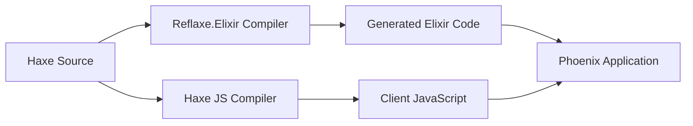

# 🏗️ Todo App Architecture & Development Guide

## Overview

This todo-app is a **100% Haxe-powered Phoenix LiveView application** that compiles to both Elixir (backend) and JavaScript (frontend). Every `.ex` file in `lib/` is generated from Haxe source - we write type-safe Haxe and get idiomatic Elixir.

## 🎯 Core Philosophy

**Write Once in Haxe, Deploy Everywhere**
- All business logic in type-safe Haxe
- Compiles to idiomatic Elixir for Phoenix
- Compiles to optimized JavaScript for frontend
- Zero manual Elixir code in the application layer

## 📁 Project Structure

```
todo-app/
├── src_haxe/              # 🎯 ALL SOURCE CODE LIVES HERE
│   ├── TodoApp.hx        # Main application entry
│   ├── TodoAppRouter.hx  # Phoenix router definition
│   ├── server/           # Backend code (→ Elixir)
│   │   ├── live/         # LiveView modules
│   │   │   ├── TodoLive.hx
│   │   │   └── UserLive.hx
│   │   ├── schemas/      # Ecto schemas
│   │   │   ├── Todo.hx
│   │   │   └── User.hx
│   │   ├── contexts/     # Business logic
│   │   │   └── Todos.hx
│   │   ├── layouts/      # Phoenix layouts
│   │   │   ├── RootLayout.hx
│   │   │   └── AppLayout.hx
│   │   └── infrastructure/
│   │       ├── Endpoint.hx
│   │       ├── Repo.hx
│   │       └── Telemetry.hx
│   └── client/           # Frontend code (→ JavaScript)
│       └── TodoApp.hx    # Client-side enhancements
│
├── lib/                  # ⚡ GENERATED ELIXIR CODE (DO NOT EDIT!)
│   ├── todo_app_web/     # Phoenix web layer
│   │   ├── router.ex     # Generated from TodoAppRouter.hx
│   │   └── live/         # Generated LiveViews
│   ├── todo_app/         # Business logic layer
│   │   ├── schemas/      # Generated Ecto schemas
│   │   └── contexts/     # Generated contexts
│   └── [many .ex files]  # Generated Haxe stdlib, helpers
│
├── build.hxml            # Main build configuration
├── build-server.hxml     # Server compilation (Haxe→Elixir)
├── build-client.hxml     # Client compilation (Haxe→JavaScript)
├── mix.exs               # Elixir project config (manual)
└── config/               # Phoenix config (manual)
```

## 🔄 Compilation Flow

### How It Works



### Compilation Commands

```bash
# One-time compilation
npx haxe build.hxml          # Compile everything
npx haxe build-server.hxml   # Compile server only (Haxe→Elixir)
npx haxe build-client.hxml   # Compile client only (Haxe→JS)

# Development with file watching
mix compile.haxe --watch     # Watch src_haxe/ and auto-compile

# Clean and rebuild
rm -rf lib/*.ex lib/**/*.ex  # Remove all generated files
npx haxe build-server.hxml   # Regenerate fresh
```

## 🚀 Getting Started

### Prerequisites

- **Haxe 4.3+** - The source language
- **Elixir 1.14+** - Runtime for backend
- **Phoenix 1.7+** - Web framework
- **PostgreSQL** - Database
- **Node.js 16+** - For JavaScript tooling

### Initial Setup

```bash
# 1. Install Elixir dependencies
mix deps.get

# 2. Install JavaScript dependencies
npm install

# 3. Compile Haxe→Elixir (generates all .ex files)
npx haxe build-server.hxml

# 4. Setup database
mix ecto.create
mix ecto.migrate

# 5. Compile assets
npm run build

# 6. Start Phoenix server
mix phx.server
```

Visit http://localhost:4000 to see the app!

### Development Workflow

```bash
# Terminal 1: File watcher for Haxe→Elixir compilation
mix compile.haxe --watch

# Terminal 2: Phoenix server with live reload
mix phx.server

# Terminal 3: JavaScript compilation watcher (if needed)
npm run watch
```

## ⚠️ Critical Rules

### NEVER Edit Generated Files
- **All `.ex` files in `lib/` are GENERATED**
- Changes will be lost on next compilation
- Always edit the `.hx` source in `src_haxe/`

### When You See Compilation Errors
- **DON'T patch the `.ex` files** - they're generated
- **DO fix the Haxe compiler** at `/src/reflaxe/elixir/`
- **DO fix the Haxe source** in `src_haxe/`

### File Generation Issues (Current State)

**Known Issues:**
1. **Duplicate modules** - Some modules generate in multiple locations
2. **Path casing** - Fixed but may have remnants

**Recently Resolved:**
- ✅ **Missing imports** - Phoenix.Component now properly imported for ~H sigil usage
- ✅ **Variable substitution** - Lambda expressions now generate correct variable names
- ✅ **Hardcoded app names** - Compiler now works with any Phoenix application, not just TodoApp

**Note**: Previous PascalCase file generation issues have been resolved. Files now generate with proper snake_case names and directory structure.

## 🤖 Using with LLMs (Claude, ChatGPT, etc.)

### Key Context to Provide

When asking an LLM for help, always mention:
1. **This is a Haxe→Elixir compiled project**
2. **All `.ex` files are generated, not hand-written**
3. **Source code is in `src_haxe/` directory**
4. **Using Reflaxe.Elixir compiler**

### Example Prompt
```
I'm working on a Phoenix LiveView todo app where all Elixir code is 
generated from Haxe source files. The source is in src_haxe/ and 
compiles to lib/. When I compile, I get [error]. How should I fix 
the Haxe source or compiler to generate correct Elixir?
```

## 🎯 Architecture Decisions

### Why Haxe?
- **Type Safety** - Catch errors at compile time
- **Single Source** - One codebase for backend + frontend
- **IDE Support** - Full autocomplete and refactoring
- **Cross-platform** - Same business logic everywhere

### Why Generated Code?
- **No Manual Sync** - Haxe source is the single truth
- **Framework Updates** - Regenerate for new Phoenix versions
- **Type Guarantees** - Generated code matches types exactly

### Framework Integration

The app uses standard Phoenix patterns:
- **LiveView** for real-time UI
- **Ecto** for database
- **PubSub** for broadcasting
- **Channels** for WebSocket communication

But all implemented in Haxe with annotations:
- `@:liveview` → Phoenix.LiveView module
- `@:schema` → Ecto.Schema module
- `@:router` → Phoenix.Router module
- `@:changeset` → Ecto.Changeset functions

## 📊 Compilation Pipeline Details

### Annotation Processing
```haxe
@:liveview
class TodoLive {
    // Haxe source
}
```
↓ Compiles to ↓
```elixir
defmodule TodoAppWeb.TodoLive do
  use TodoAppWeb, :live_view
  # Generated Elixir
end
```

### File Placement
- `TodoAppRouter.hx` → `lib/todo_app_web/router.ex`
- `TodoLive.hx` → `lib/todo_app_web/live/todo_live.ex`
- `Todo.hx` → `lib/todo_app/schemas/todo.ex`
- `Todos.hx` → `lib/todo_app/todos.ex`

### Standard Library
The Haxe standard library types compile to Elixir:
- `haxe.ds.Map` → `lib/haxe/ds/map.ex`
- `haxe.io.Bytes` → `lib/haxe/io/bytes.ex`
- Many helper modules for Haxe compatibility

## 🔧 Troubleshooting

### "Module not found" Errors
- Check if the Haxe source compiled successfully
- Verify file is in correct location (snake_case paths)
- Remove duplicate modules from different paths

### "Function undefined" Errors  
- Missing Phoenix imports in generated code
- Compiler needs to add proper `use` statements
- Temporary fix: Add to compiler output

### Database Errors
```bash
# Reset database completely
mix ecto.drop
mix ecto.create
mix ecto.migrate
```

### Clean Build
```bash
# Nuclear option - regenerate everything
rm -rf lib/*.ex lib/**/*.ex
rm -rf _build deps
mix deps.get
npx haxe build-server.hxml
mix compile
```

## 🚧 Current Status

### ✅ Working
- Haxe→Elixir compilation
- Router generation
- LiveView modules
- Ecto schemas
- Phoenix layouts

### 🔧 Needs Fixes
- Missing Phoenix.Component imports
- Duplicate module generation
- Template variable handling
- HEEx sigil processing

### 🎯 Next Steps
1. Fix sigil_H import issues
2. Resolve duplicate modules
3. Add comprehensive tests
4. Improve error messages

## 📚 Learn More

- [Reflaxe.Elixir Documentation](../../docs/README.md)
- [Haxe Language Manual](https://haxe.org/manual/)
- [Phoenix Framework Guides](https://hexdocs.pm/phoenix)
- [Compiler Source Code](../../src/reflaxe/elixir/)

## 💡 Tips for Development

1. **Always compile Haxe first** before running Phoenix
2. **Use the watcher** for rapid development
3. **Check generated code** to understand issues
4. **Fix at the source** - either Haxe or compiler
5. **Document patterns** that work for future reference

---

Remember: This is a cutting-edge approach to Phoenix development. You're writing
Haxe to get type-safe, maintainable Elixir code. When it works, it's magical! 
When it doesn't, check the compiler output and fix the transformation.
