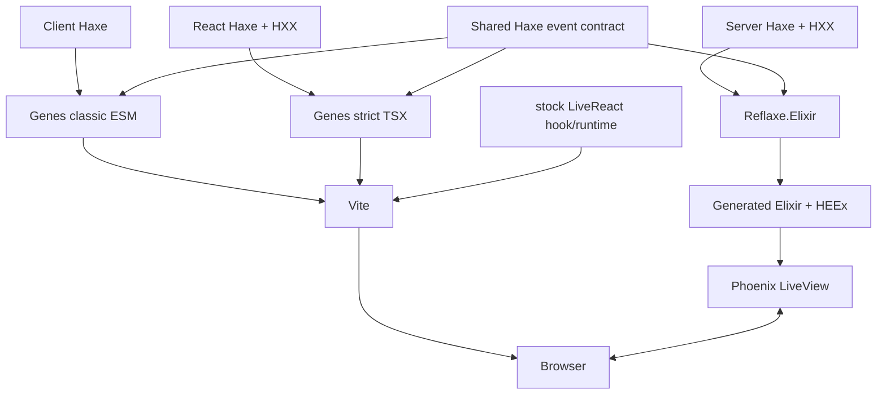

# Todo App Architecture

This application is a Haxe-first Phoenix LiveView project. Application modules,
LiveViews, components, event contracts, and ExUnit tests are authored in Haxe.
Reflaxe.Elixir generates ordinary Elixir and HEEx. Browser code is also authored
in Haxe and compiled by Genes either to classic ESM JavaScript or to strict
TypeScript/TSX.

It is still a normal Phoenix project. Mix configuration, dependency manifests,
the Vite host entry, and a few infrastructure files stay in their ecosystem's
native format. Haxe-first means “use Haxe wherever it improves the application
and compiler evidence,” not “hide Phoenix, Elixir, React, or JavaScript.”

## Runtime ownership

| Concern | Owner | What this example adds |
| --- | --- | --- |
| Page state, navigation, forms, todo operations | Phoenix LiveView | Typed Haxe authoring and generated HEEx |
| React mounting and LiveView bridge | stock LiveReact | Static registry and closed app boundary |
| React rendering | stock React/ReactDOM | Haxe-authored component compiled by Genes |
| Browser source compilation | Genes | Classic ESM and strict TSX jobs from one exact Lix pin |
| JavaScript bundling | Vite | One asset graph for Phoenix, Genes, LiveReact, and React |

PhoenixHX does not copy or replace the LiveReact hook, DOM protocol, renderer,
or Vite plugin. The application depends on upstream `:live_react`, and npm
consumes that same Mix checkout through a relative `file:` dependency.

## Source layout

```text
todo-app/
├── src_haxe/
│   ├── server/                 Haxe → Elixir/Phoenix
│   ├── client/                 Haxe → classic Genes ESM
│   └── test/                   Haxe → ExUnit
├── src_react/                  Haxe → Genes TypeScript/TSX
├── src_shared/                 Small target-neutral contracts
├── assets/
│   ├── js/app.js               Phoenix/Vite host boundary
│   ├── js/live-react-hooks.js  Generated stock-LiveReact hook registration
│   └── react-components/
│       ├── registry.generated.ts
│       └── generated/          Genes output; do not edit
├── lib/                        Generated Elixir; do not edit
├── test/generated/             Generated ExUnit; do not edit
├── phoenixhx-live-react.json   Opt-in integration and static registry manifest
├── build-server.hxml           Haxe → Elixir application build
├── build-client.hxml           Classic ESM + strict TSX browser builds
└── build-tests.hxml            Haxe → ExUnit build
```

`src_shared` is intentionally narrow. It holds data contracts and event
protocols that genuinely belong on both sides. Importing the whole server tree
into a browser or test build would couple unrelated code and make dead-code
elimination less trustworthy.

## The two HXX paths

HXX gives both Haxe source trees a familiar inline-markup authoring style, but
the compilers and target frameworks remain explicit.

### 1. Server HXX becomes HEEx

The server wrapper is authored in
`src_haxe/server/components/TodoInsightsIsland.hx`:

```haxe
return <LiveReact.react
  id=${assigns.id}
  name="TodoInsights"
  total=${assigns.total}
  filter=${assigns.filter}
  ssr=${false}
/>;
```

Reflaxe.Elixir emits an ordinary Phoenix component call inside `~H`:

```heex
<LiveReact.react
  id={@id}
  name="TodoInsights"
  total={@total}
  filter={@filter}
  ssr={false}
/>
```

The app-local `StockLiveReact` extern gives strict HXX a closed prop contract.
It describes the upstream module; it does not generate or wrap a new LiveReact
runtime.

### 2. Browser HXX becomes React TSX

The inner component is authored in
`src_react/todo_insights/TodoInsightsIsland.hx`:

```haxe
function TodoInsights(props:TodoInsightsProps):Element {
  return <div data-testid="todo-insights" data-active-filter={props.filter}>
    <button onClick={() -> props.onFilter(Completed)}>Done</button>
  </div>;
}
```

Genes emits typed TSX and the exposed `TodoInsightsBoundary` export. Vite then
bundles it as normal React source. The generated static registry maps the fixed
name `TodoInsights` to that export; request data cannot choose an arbitrary
module.

### 3. Stock LiveReact connects them

```text
Haxe server wrapper
  → generated HEEx calling LiveReact.react
  → LiveReact serializes props into its DOM protocol
  → stock LiveReact hook finds TodoInsights in the static registry
  → Haxe/Genes React boundary validates props and mounts the inner component
  → typed callback pushes a normal LiveView event
  → generated Haxe Live Event dispatcher updates LiveView state
```

Only serializable props and events cross that boundary. A Haxe type can be
shared as a compile-time contract, but a BEAM process, socket, function, Ecto
schema instance, or arbitrary server object does not become a browser value.

## Trusted boundary and fallback

Upstream LiveReact supplies bridge functions such as `pushEvent` to the trusted
boundary component. The inner `TodoInsights` component does not receive that
open bridge. It receives closed semantic props and one `onFilter` callback.

The boundary:

- rejects missing or unknown public props;
- checks strings, integers, and the closed filter values;
- checks that `pushEvent` is callable;
- translates `onFilter` through the generated Live Event Protocol adapter;
- renders a local error panel if validation fails.

This is capability narrowing for first-party code, not a security sandbox for
untrusted React modules.

The server wrapper always renders a useful native LiveView summary outside the
React mount. Todo CRUD and the normal LiveView filter controls remain available
when JavaScript is disabled or the island fails to mount. The React section is
an enhancement, never the only path to an application operation.

## Client-only rendering and SSR

This example fixes `ssr=false`.

1. Phoenix renders the native summary and LiveReact mount data.
2. The browser downloads the Vite bundle.
3. The stock hook mounts the React component on the client.

LiveReact SSR is a different deployment topology. It asks upstream LiveReact to
render the React component through a Node/Vite SSR process on the server, sends
that HTML in the initial response, and then hydrates it in the browser. That
requires Node supervision, release artifacts, hydration compatibility, failure
handling, and additional operational tests. PhoenixHX tracks it separately; it
is not implied by using HXX or by keeping both source trees in Haxe.

## Build graph


```mermaid
graph TD
  SH[Server Haxe + HXX] --> RE[Reflaxe.Elixir]
  RE --> EX[Generated Elixir + HEEx]
  CH[Client Haxe] --> GE[Genes classic ESM]
  RH[React Haxe + HXX] --> GT[Genes strict TSX]
  SP[Shared Haxe event contract] --> RE
  SP --> GE
  SP --> GT
  EX --> PHX[Phoenix LiveView]
  GE --> V[Vite]
  GT --> V
  LR[stock LiveReact hook/runtime] --> V
  V --> B[Browser]
  PHX <--> B
```

Vite is the only JavaScript bundler. Genes produces source modules; it does not
compete with Vite. Tailwind remains a separate CSS lane.

## Commands

```bash
# Generate the Phoenix application modules.
haxe build-server.hxml

# Generate classic ESM plus the strict TSX React module.
haxe build-client.hxml

# Prove the Haxe-authored React boundary without a browser.
npm --prefix assets run test:live-react

# Type-check generated production TSX and build Vite assets.
npm --prefix assets run typecheck:live-react
npm --prefix assets run assets:build

# Compile and run Haxe-authored ExUnit tests.
haxe build-tests.hxml
mix test
```

The public integration lifecycle is:

```bash
mix haxe.phoenix.live_react          # plan and apply owned setup
mix haxe.phoenix.live_react --check  # read-only drift check
mix haxe.phoenix.live_react --remove # remove only integration-owned state
```

`--remove` preserves hand-owned application components. It refuses ambiguous
ownership rather than deleting a custom Vite or React setup.

## Evidence boundaries

- Haxe→ExUnit tests prove the server wrapper, native fallback, typed event
  dispatch, and malformed-known-payload behavior.
- The Haxe-authored React contract test renders the generated component through
  ReactDOM and checks exact-boundary failure behavior.
- Playwright proves the stock hook mounts the island, the callback updates
  LiveView, and the native page remains useful with JavaScript disabled.
- Vite production build proves bundling and source-map generation.

Do not edit `lib/**`, `test/generated/**`, or
`assets/react-components/generated/**`. Poor generated output belongs in the
Haxe source, Genes, or Reflaxe.Elixir—not in a manual patch to an artifact.

## Further reading

- [Project README](README.md)
- [Phoenix output model](../../docs/05-architecture/PHOENIX_OUTPUT_MODEL.md)
- [Genes dependency workflow](../../docs/03-compiler-development/GENES_DEPENDENCY_WORKFLOW.md)
- [Phoenix LiveView](https://hexdocs.pm/phoenix_live_view/)
- [LiveReact](https://github.com/mrdotb/live_react)
