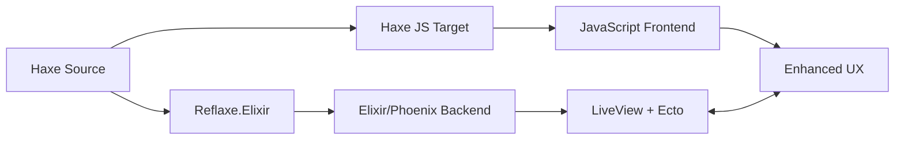

# 📝 Todo App - Full-Stack Haxe with Phoenix LiveView

A comprehensive todo application showcasing Reflaxe.Elixir v1.0 capabilities, featuring:
- **Haxe → Elixir** compilation for backend logic
- **Haxe → JavaScript** compilation for enhanced frontend
- **Phoenix LiveView** for real-time updates
- **Ecto** for database persistence
- **PubSub** for multi-user synchronization

## 🌟 Features

### Backend (Haxe → Elixir)
- ✅ Complete CRUD operations for todos
- ✅ Ecto schemas with validations
- ✅ LiveView components with real-time updates
- ✅ PubSub for multi-user synchronization
- ✅ User authentication and authorization
- ✅ Priority levels and due dates
- ✅ Tag system for organization
- ✅ Bulk operations (complete all, clear completed)

### Frontend (Haxe → JavaScript)
- ✅ Drag-and-drop reordering
- ✅ Keyboard shortcuts (Cmd+N, Cmd+F, Alt+1/2/3)
- ✅ Offline support with local storage
- ✅ Browser notifications for reminders
- ✅ Rich text editing with markdown
- ✅ File drag-and-drop for imports
- ✅ Smooth animations and transitions
- ✅ Progressive enhancement

## 🚀 Quick Start

### Prerequisites
- Elixir 1.14+
- Phoenix 1.7+
- PostgreSQL
- Node.js 16+
- Haxe 4.3+

### Installation

```bash
# From examples/todo-app

# 1) One‑time setup (deps, DB, tools, client build)
mix setup

# 2) Start the app with watchers (after first‐time setup)
mix dev

# Optional: explicit build steps
# Build client bundle + server code, then run
mix assets.build && mix compile
mix phx.server
```

Visit `http://localhost:4000` to see the app.

## 🔍 Background Runtime-Debug Loop

Once the app compiles, use a background server + curl loop to surface and fix runtime errors quickly. This augments the compile loop with fast runtime validation.

Prerequisites
- Postgres running and accessible (see `config/dev.exs`)
- Deps installed and DB created/migrated

Build (server + client) using Mix
```bash
# From examples/todo-app
mix assets.build                  # Builds client (Haxe→JS via haxe.compile.client, then esbuild)
mix compile --force               # Compiles server (Haxe→Elixir via Mix compiler)
```

Start Phoenix in the background with logs
```bash
# Kill previous run (if any)
if [ -f tmp_server_bg.pid ]; then kill "$(cat tmp_server_bg.pid)" 2>/dev/null || true; rm -f tmp_server_bg.pid; fi

# Start and capture logs
: > tmp_server_bg.log
( MIX_ENV=dev nohup mix phx.server >> tmp_server_bg.log 2>&1 & echo $! > tmp_server_bg.pid )

# Give it a moment to boot
sleep 5
```

Health check and error capture
```bash
# Verify it is listening
lsof -i :4000 -sTCP:LISTEN -n -P || true

# Inspect the response (headers + first lines)
curl -sS -i http://localhost:4000 | sed -n '1,60p'

# Save full error page for precise stack details when 500 occurs
curl -sS http://localhost:4000 > /tmp/todo_err.html

# Tail recent server logs
tail -n 120 tmp_server_bg.log

# Grep for common runtime issues
rg -n "KeyError|RuntimeError|Undefined|Protocol.UndefinedError" tmp_server_bg.log -S || true
```

Iteration loop (fix → rebuild → reload)
```bash
# 1) Edit Haxe/AST transforms or example source to fix the root cause

# 2) Rebuild server output
mix compile --force

# 3) Let Phoenix code reloader pick up changes, or restart the background server
kill "$(cat tmp_server_bg.pid)" 2>/dev/null || true
( MIX_ENV=dev nohup mix phx.server >> tmp_server_bg.log 2>&1 & echo $! > tmp_server_bg.pid )
sleep 5

# 4) Re-check runtime behavior
curl -sS -i http://localhost:4000 | sed -n '1,60p'
tail -n 120 tmp_server_bg.log
```

Alternative: stable background run without code reloader
```bash
# Some debugging sessions are more stable with the application tree under :run --no-halt
if [ -f tmp_run_bg.pid ]; then kill "$(cat tmp_run_bg.pid)" 2>/dev/null || true; rm -f tmp_run_bg.pid; fi
: > tmp_run_bg.log
( MIX_ENV=dev nohup mix run --no-halt >> tmp_run_bg.log 2>&1 & echo $! > tmp_run_bg.pid )
sleep 5
curl -sS -i http://localhost:4000 | sed -n '1,60p'
```

Clean stop
```bash
if [ -f tmp_server_bg.pid ]; then kill "$(cat tmp_server_bg.pid)" 2>/dev/null || true; rm -f tmp_server_bg.pid; fi
if [ -f tmp_run_bg.pid ]; then kill "$(cat tmp_run_bg.pid)" 2>/dev/null || true; rm -f tmp_run_bg.pid; fi
```

Tips
- Use `mix compile --force` (or `mix compile.haxe --watch`) on source changes; add the curl+logs check to catch assign shape issues, HEEx contract violations, Presence wiring, etc.
- Prefer fixing transforms/Haxe source over editing generated Elixir. If you patch generated files for triage, follow up with proper fixes in the AST pipeline.
- If custom Postgrex `types:` config causes local TypeManager errors, either define the types module or remove the option for local debugging.

## 🏗️ Architecture

### Project Structure
```
todo-app/
├── src_haxe/              # Haxe source code
│   ├── schemas/           # Ecto schemas (Todo, User)
│   ├── live/              # LiveView components
│   ├── templates/         # HEEx templates (.hxx)
│   ├── contexts/          # Business logic
│   ├── services/          # Background services
│   └── client/            # Client-side JavaScript
├── lib/                   # Generated Elixir code
├── priv/static/assets/    # Bundled JS/CSS (esbuild output)
├── build.hxml             # Server (Haxe→Elixir) build
└── build-client.hxml      # Client (Haxe→JS) build (used by assets alias)
```

### Compilation Flow



## 💻 Development Workflow

### Phoenix JS Bootstrap (phoenix_app.js)
- Entry point: `assets/js/phoenix_app.js` (hand‑written JS, bundled by esbuild).
- Responsibilities:
  - Import `phoenix_html`, `phoenix`, and `phoenix_live_view`.
  - Read CSRF meta from the HTML `<meta name="csrf-token" ...>`.
  - Pick up LiveView Hooks from `window.Hooks` (populated by the Haxe bundle).
  - Create and connect `LiveSocket`, and expose `window.liveSocket`.
- Haxe integration:
  - The Haxe client compiles to `assets/js/app.js` (`build-client.hxml`).
  - `phoenix_app.js` imports `./app.js`, so any Hooks you export via Haxe are available to LiveView.
- Why JS here and not Haxe?
  - This file mirrors Phoenix’s canonical bootstrap and stays stable across Phoenix upgrades.
  - All meaningful client behavior (Hooks, utils, shared types) remains in Haxe for type safety.

### Watch Mode
```bash
# Recommended: single terminal with Phoenix watchers (server+client)
mix dev

# Optional (manual split):
# Terminal 1 (Phoenix with assets watchers)
mix phx.server
# Terminal 2 (manual client build)
npm --prefix assets run watch:haxe
```

Note
- The Haxe client watcher is launched via npm (`npm --prefix assets run watch:haxe`).
- If npm is not available on PATH, Phoenix starts without the Haxe watcher; you can still build once with `mix assets.build`.

### CSRF meta tag
- The layout emits a standard Phoenix CSRF meta tag using Plug:
  - `examples/todo-app/lib/todo_app_web/layouts.ex` includes
    `<meta name="csrf-token" content={Plug.CSRFProtection.get_csrf_token()}/>`
- LiveSocket reads this token in `phoenix_app.js` and passes it as `_csrf_token`.
```

### Testing
```bash
# Run all tests
mix test

# Test Haxe compilation
npx haxe test.hxml

# Test JavaScript output
npm test
```

## 🎯 Key Code Examples

### Ecto Schema with Validation (Haxe)
```haxe
@:schema
class Todo {
    @:field public var title: String;
    @:field public var completed: Bool = false;
    @:field public var priority: String = "medium";
    
    @:changeset
    public static function changeset(todo: Dynamic, params: Dynamic): Dynamic {
        return todo
            .cast(params, ["title", "completed", "priority"])
            .validate_required(["title"])
            .validate_inclusion("priority", ["low", "medium", "high"]);
    }
}
```

### LiveView Component (Haxe)
```haxe
@:liveview
class TodoLive {
    public static function handle_event("toggle_todo", params, socket) {
        var todo = find_todo(params.id);
        var updated = Todo.toggle_completed(todo);
        Repo.update(updated);
        
        Phoenix.PubSub.broadcast("todo:updates", {
            type: "todo_updated",
            todo: updated
        });
        
        return update_todo_in_list(updated, socket);
    }
}
```

### Client-Side Enhancement (Haxe → JavaScript)
```haxe
class TodoApp {
    static function setupKeyboardShortcuts() {
        Browser.document.addEventListener("keydown", function(e) {
            if ((e.ctrlKey || e.metaKey) && e.key == "n") {
                e.preventDefault();
                pushEvent("toggle_form", {});
            }
        });
    }
}
```

## 🔥 LiveView Real-Time Features

### Multi-User Sync
All users see updates in real-time:
- ✅ Todo creation/updates/deletion
- ✅ Status changes (complete/incomplete)
- ✅ Priority updates
- ✅ Bulk operations

### PubSub Events
```elixir
# Broadcast from any user
Phoenix.PubSub.broadcast("todo:updates", %{
  type: "todo_created",
  todo: new_todo
})

# All connected users receive update
def handle_info(%{type: "todo_created", todo: todo}, socket) do
  {:noreply, add_todo_to_list(todo, socket)}
end
```

## 🎨 UI Features

### Keyboard Shortcuts
- `Cmd/Ctrl + N` - New todo
- `Cmd/Ctrl + F` - Focus search
- `Alt + 1/2/3` - Filter (All/Active/Completed)
- `Escape` - Close forms/cancel edit
- `Cmd/Ctrl + Enter` - Quick add todo

### Drag & Drop
- Reorder todos by dragging
- Drop text files to import todos
- Drop images to attach to todos

### Offline Support
- Caches todos in localStorage
- Queues actions when offline
- Syncs automatically when reconnected
- Shows offline indicator

## 📊 Performance

### Compilation Times
- Haxe → Elixir: ~200ms
- Haxe → JavaScript: ~150ms
- Total build: <400ms

### Runtime Performance
- LiveView updates: <50ms
- PubSub broadcast: <10ms
- Offline sync: <100ms
- Drag & drop: 60fps

## 🧪 Testing Strategy

### Backend Tests (Elixir)
```elixir
test "toggles todo completion status" do
  todo = insert(:todo, completed: false)
  
  {:ok, updated} = Todos.toggle_completed(todo)
  
  assert updated.completed == true
end
```

### Frontend Tests (JavaScript)
```javascript
describe("TodoApp", () => {
  it("handles keyboard shortcuts", () => {
    const event = new KeyboardEvent("keydown", {
      key: "n",
      ctrlKey: true
    });
    
    document.dispatchEvent(event);
    
    expect(formVisible()).toBe(true);
  });
});
```

## 🚢 Deployment

### Production Build
```bash
# Compile server and bundle client assets
MIX_ENV=prod mix assets.deploy
MIX_ENV=prod mix compile

# Build release
MIX_ENV=prod mix release

# Deploy
_build/prod/rel/todo_app/bin/todo_app start
```

### Docker
```dockerfile
FROM elixir:1.14-alpine
WORKDIR /app
COPY . .
RUN mix deps.get && \
    MIX_ENV=prod mix assets.deploy && \
    MIX_ENV=prod mix compile && \
    MIX_ENV=prod mix release
CMD ["_build/prod/rel/todo_app/bin/todo_app", "start"]
```

## 📚 Learning Resources

### Reflaxe.Elixir Documentation
- [Getting Started](../../documentation/GETTING_STARTED.md)
- [LiveView Guide](../../documentation/guides/LIVEVIEW_GUIDE.md)
- [Ecto Integration](../../documentation/guides/ECTO_GUIDE.md)

### Key Concepts Demonstrated
1. **Dual Compilation**: Same language (Haxe) for both backend and frontend
2. **Type Safety**: Compile-time validation across the full stack
3. **Real-Time**: LiveView + PubSub for instant updates
4. **Progressive Enhancement**: Works without JS, enhanced with it
5. **Offline First**: Local storage and sync capabilities

## 🤝 Contributing

This example is part of Reflaxe.Elixir v1.0. Contributions welcome!

1. Fork the repository
2. Create your feature branch
3. Add tests for new functionality
4. Submit a pull request

## 📝 License

MIT - See LICENSE file in project root

---

**Built with Reflaxe.Elixir v1.0** - Write once in Haxe, run everywhere! 🚀
