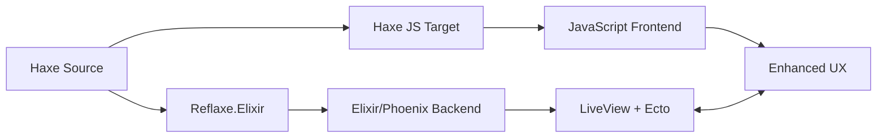

# 📝 Todo App - Full-Stack Haxe with Phoenix LiveView

End-to-end reference app showcasing Reflaxe.Elixir in a real Phoenix LiveView application:

- **Server**: Haxe → Elixir (LiveView + Ecto + PubSub)
- **Client**: Haxe → JavaScript (LiveView hooks + progressive enhancement)
- **E2E tests**: Playwright

## 🌟 Features

### Backend (Haxe → Elixir)
- Todo CRUD + typed LiveView assigns
- Ecto schemas + migrations
- Optional demo login + profile (session-based)
- Users directory + status toggle (LiveView)
- Tag filtering + search + sorting
- PubSub broadcasts so multiple sessions update live
- Bulk actions (complete all / delete completed)

Note on “multiple instances”:
- The default Phoenix PubSub in this example broadcasts **within a single Phoenix node**.
- Live updates propagate across multiple **browser sessions** connected to the same server process.
- If you run multiple `mix phx.server` instances, you’ll only get cross-instance sync if you also configure node clustering / distributed PubSub.

### Frontend (Haxe → JavaScript)
- LiveView hooks authored in Haxe (progressive enhancement)
- Keyboard shortcuts + small UX helpers
- Optional offline/connection-state behaviors

The client is intentionally kept “thin”: most logic stays on the server (LiveView), with JS as an enhancement layer.

## 🚀 Quick Start

### Prerequisites
- Elixir 1.14+
- Phoenix 1.7+
- PostgreSQL
- Node.js 16+
- Haxe 4.3+

### Installation

```bash
# From examples/todo-app

# 1) One‑time setup (deps, DB, tools, client build)
mix setup

# 2) Start the app with watchers (after first‐time setup)
mix dev
```

Visit `http://localhost:4000` to see the app.

## Where to Look (Code Tour)

- LiveView: `examples/todo-app/src_haxe/server/live/TodoLive.hx`
- Typed assigns/types: `examples/todo-app/src_haxe/server/live/TodoLiveTypes.hx`
- Ecto schema: `examples/todo-app/src_haxe/server/schemas/Todo.hx`
- Client hooks: `examples/todo-app/src_haxe/client/hooks/`
- Playwright specs: `examples/todo-app/e2e/*.spec.ts`

## QA / E2E

This repo includes a non-blocking QA sentinel that:
- compiles Haxe → Elixir
- runs `mix compile`
- boots Phoenix in the background
- probes readiness + runs Playwright

From repo root:

```bash
scripts/qa-sentinel.sh --app examples/todo-app --port 4001 --playwright --e2e-spec "e2e/*.spec.ts" --async --deadline 900 --verbose
```

Alternative: stable background run without code reloader
```bash
# Some debugging sessions are more stable with the application tree under :run --no-halt
if [ -f tmp_run_bg.pid ]; then kill "$(cat tmp_run_bg.pid)" 2>/dev/null || true; rm -f tmp_run_bg.pid; fi
: > tmp_run_bg.log
( MIX_ENV=dev nohup mix run --no-halt >> tmp_run_bg.log 2>&1 & echo $! > tmp_run_bg.pid )
sleep 5
curl -sS -i http://localhost:4000 | sed -n '1,60p'
```

Clean stop
```bash
if [ -f tmp_server_bg.pid ]; then kill "$(cat tmp_server_bg.pid)" 2>/dev/null || true; rm -f tmp_server_bg.pid; fi
if [ -f tmp_run_bg.pid ]; then kill "$(cat tmp_run_bg.pid)" 2>/dev/null || true; rm -f tmp_run_bg.pid; fi
```

Tips
- Use `mix compile --force` (or `mix haxe.watch`) on source changes; add the curl+logs check to catch assign shape issues, HEEx contract violations, Presence wiring, etc.
- Prefer fixing transforms/Haxe source over editing generated Elixir. If you patch generated files for triage, follow up with proper fixes in the AST pipeline.
- If custom Postgrex `types:` config causes local TypeManager errors, either define the types module or remove the option for local debugging.

## 🏗️ Architecture

### Project Structure
```
todo-app/
├── src_haxe/              # Haxe source code
│   ├── schemas/           # Ecto schemas (Todo, User)
│   ├── live/              # LiveView components
│   ├── templates/         # HEEx templates (.hxx)
│   ├── contexts/          # Business logic
│   ├── services/          # Background services
│   └── client/            # Client-side JavaScript
├── lib/                   # Generated Elixir code
├── priv/static/assets/    # Bundled JS/CSS (esbuild output)
├── build.hxml             # Server (Haxe→Elixir) build
└── build-client.hxml      # Client (Haxe→JS) build (used by assets alias)
```

Build note:
- The canonical entrypoints are `build.hxml` (server), `build-client.hxml` (client), and `build-tests.hxml` (tests).
- Historical multi-pass/prewarm build experiments were archived under `docs/09-history/archive/records/todo-app-hxml-legacy/` and are not required for normal development.

### Is the todo-app “100% Haxe”?

The todo-app is designed to demonstrate **end-to-end Haxe→Elixir** for application code, while still being a *normal* Phoenix project.

**Generated from Haxe**
- Server app code: `examples/todo-app/src_haxe/server/**` → `examples/todo-app/lib/todo_app/**` and `examples/todo-app/lib/todo_app_web/**`
- Shared/domain types: `examples/todo-app/src_haxe/shared/**` → `examples/todo-app/lib/shared/**`
- Client hooks: `examples/todo-app/src_haxe/client/**` → bundled JS under `priv/static/assets/` via `build-client.hxml`

**Hand-written (Elixir/Phoenix conventions)**
- Phoenix project scaffolding and configuration: `mix.exs`, `config/*.exs`
  - Why: Phoenix expects these files and patterns; keeping them idiomatic makes gradual adoption easy.
- Ecto seeds: `priv/repo/seeds.exs`
  - Why: Ecto executes seeds as Elixir scripts; keeping them Elixir-first is fine for an example app.
- Phoenix JS bootstrap: `assets/js/phoenix_app.js`
  - Why: this mirrors Phoenix’s canonical LiveView bootstrap and stays stable across Phoenix upgrades (see section above).

**Haxe-authored migrations (compiled to `.exs`)**
- Haxe sources: `examples/todo-app/src_haxe/server/migrations/*.hx`
- Runtime artifacts: `examples/todo-app/priv/repo/migrations/*.exs` (generated via `build-migrations.hxml` / `mix haxe.compile.migrations`)
- Why: Ecto requires `.exs` files under `priv/repo/migrations/`, but the migration logic can still be authored in Haxe.

**Intentional small Elixir helper**
- `examples/todo-app/lib/todo_app/flash.ex`
  - Why: it’s a tiny, stable helper module and also demonstrates that you can mix Haxe-generated modules with hand-written Elixir where it makes sense.
  - If you want a “pure Haxe” demo, this module can be moved into `src_haxe/` later (without changing the overall architecture).

### Compilation Flow



## 💻 Development Workflow

### Phoenix JS Bootstrap (phoenix_app.js)
- Entry point: `assets/js/phoenix_app.js` (hand‑written JS, bundled by esbuild).
- Responsibilities:
  - Import `phoenix_html`, `phoenix`, and `phoenix_live_view`.
  - Read CSRF meta from the HTML `<meta name="csrf-token" ...>`.
  - Pick up LiveView Hooks from `window.Hooks` (populated by the Haxe bundle).
  - Create and connect `LiveSocket`, and expose `window.liveSocket`.
- Haxe integration:
  - The Haxe client compiles to `assets/js/app.js` (`build-client.hxml`).
  - `phoenix_app.js` imports `./app.js`, so any Hooks you export via Haxe are available to LiveView.
- Why JS here and not Haxe?
  - This file mirrors Phoenix’s canonical bootstrap and stays stable across Phoenix upgrades.
  - All meaningful client behavior (Hooks, utils, shared types) remains in Haxe for type safety.

### Watch Mode
```bash
# Recommended: single terminal with Phoenix watchers (server+client)
mix dev

# Optional (manual split):
# Terminal 1 (Phoenix with assets watchers)
mix phx.server
# Terminal 2 (manual client build)
npm --prefix assets run watch:haxe
```

Note
- The Haxe client watcher is launched via npm (`npm --prefix assets run watch:haxe`).
- If npm is not available on PATH, Phoenix starts without the Haxe watcher; you can still build once with `mix assets.build`.

### CSRF meta tag
- The layout emits a standard Phoenix CSRF meta tag using Plug:
  - `examples/todo-app/lib/todo_app_web/layouts.ex` includes
    `<meta name="csrf-token" content={Plug.CSRFProtection.get_csrf_token()}/>`
- LiveSocket reads this token in `phoenix_app.js` and passes it as `_csrf_token`.
```

### Testing
```bash
# Run all tests
mix test

# Test Haxe compilation
haxe test.hxml

# Test JavaScript output
npm test
```

## 🎯 Key Code Examples

### Ecto Schema with Validation (Haxe)
```haxe
import ecto.Changeset;
import elixir.DateTime.NaiveDateTime;
import elixir.types.Term;

typedef TodoChangesetParams = {
    ?title: String,
    ?completed: Bool,
    ?priority: String,
    ?dueDate: Null<NaiveDateTime>,
    // polymorphic: can be a list or a comma-separated string from forms
    ?tags: Term
}

@:native("TodoApp.Todo")
@:schema("todos")
@:timestamps
@:changeset(["title", "completed", "priority", "dueDate", "tags"], ["title"])
class Todo {
    @:field @:primary_key public var id: Int;
    @:field public var title: String;
    @:field public var completed: Bool = false;
    @:field public var priority: String = "medium";
    @:field public var dueDate: Null<NaiveDateTime>;
    @:field public var tags: Null<Array<String>>;

    // Generated by the schema transformer; declare it so Haxe can call it.
    extern public static function changeset(todo: Todo, params: TodoChangesetParams): Changeset<Todo, TodoChangesetParams>;
}
```

### LiveView Component (Haxe)
```haxe
@:liveview
class TodoLive {
    // Full implementation: examples/todo-app/src_haxe/server/live/TodoLive.hx
    // Demonstrates typed assigns, typed event params, PubSub broadcasts, and handle_info updates.
}
```

### Client-Side Enhancement (Haxe → JavaScript)
```haxe
class TodoApp {
    static function setupKeyboardShortcuts() {
        Browser.document.addEventListener("keydown", function(e) {
            if ((e.ctrlKey || e.metaKey) && e.key == "n") {
                e.preventDefault();
                pushEvent("toggle_form", {});
            }
        });
    }
}
```

## 🔥 LiveView Real-Time Features

### Multi-User Sync
All users see updates in real-time:
- ✅ Todo creation/updates/deletion
- ✅ Status changes (complete/incomplete)
- ✅ Priority updates
- ✅ Bulk operations

### PubSub Events
```elixir
# Broadcast from any user
Phoenix.PubSub.broadcast("todo:updates", %{
  type: "todo_created",
  todo: new_todo
})

# All connected users receive update
def handle_info(%{type: "todo_created", todo: todo}, socket) do
  {:noreply, add_todo_to_list(todo, socket)}
end
```

## 🎨 UI Features

### Keyboard Shortcuts
- `Cmd/Ctrl + N` - New todo
- `Cmd/Ctrl + F` - Focus search
- `Alt + 1/2/3` - Filter (All/Active/Completed)
- `Escape` - Close forms/cancel edit
- `Cmd/Ctrl + Enter` - Quick add todo

### Drag & Drop
- Reorder todos by dragging
- Drop text files to import todos
- Drop images to attach to todos

### Offline Support
- Caches todos in localStorage
- Queues actions when offline
- Syncs automatically when reconnected
- Shows offline indicator

## 📊 Performance

### Compilation Times
- Haxe → Elixir: ~200ms
- Haxe → JavaScript: ~150ms
- Total build: <400ms

### Runtime Performance
- LiveView updates: <50ms
- PubSub broadcast: <10ms
- Offline sync: <100ms
- Drag & drop: 60fps

## 🧪 Testing Strategy

### Backend Tests (Elixir)
```elixir
test "toggles todo completion status" do
  todo = insert(:todo, completed: false)
  
  {:ok, updated} = Todos.toggle_completed(todo)
  
  assert updated.completed == true
end
```

### Frontend Tests (JavaScript)
```javascript
describe("TodoApp", () => {
  it("handles keyboard shortcuts", () => {
    const event = new KeyboardEvent("keydown", {
      key: "n",
      ctrlKey: true
    });
    
    document.dispatchEvent(event);
    
    expect(formVisible()).toBe(true);
  });
});
```

## 🚢 Deployment

### Production Build
```bash
# Compile server and bundle client assets
MIX_ENV=prod mix assets.deploy
MIX_ENV=prod mix compile

# Build release
MIX_ENV=prod mix release

# Deploy
_build/prod/rel/todo_app/bin/todo_app start
```

### Docker
```dockerfile
FROM elixir:1.14-alpine
WORKDIR /app
COPY . .
RUN mix deps.get && \
    MIX_ENV=prod mix assets.deploy && \
    MIX_ENV=prod mix compile && \
    MIX_ENV=prod mix release
CMD ["_build/prod/rel/todo_app/bin/todo_app", "start"]
```

## 📚 Learning Resources

### Reflaxe.Elixir Documentation
- [Quickstart](../../docs/06-guides/QUICKSTART.md)
- [LiveView Guide](../../docs/02-user-guide/PHOENIX_LIVEVIEW_ARCHITECTURE.md)
- [Ecto Integration](../../docs/07-patterns/ECTO_INTEGRATION_PATTERNS.md)

### Key Concepts Demonstrated
1. **Dual Compilation**: Same language (Haxe) for both backend and frontend
2. **Type Safety**: Compile-time validation across the full stack
3. **Real-Time**: LiveView + PubSub for instant updates
4. **Progressive Enhancement**: Works without JS, enhanced with it
5. **Offline First**: Local storage and sync capabilities

## 🤝 Contributing

This example is part of Reflaxe.Elixir v1.0. Contributions welcome!

1. Fork the repository
2. Create your feature branch
3. Add tests for new functionality
4. Submit a pull request

## 📝 License

GPL-3.0 - See LICENSE file in project root

---

**Built with Reflaxe.Elixir v1.0** - Write once in Haxe, run everywhere! 🚀
