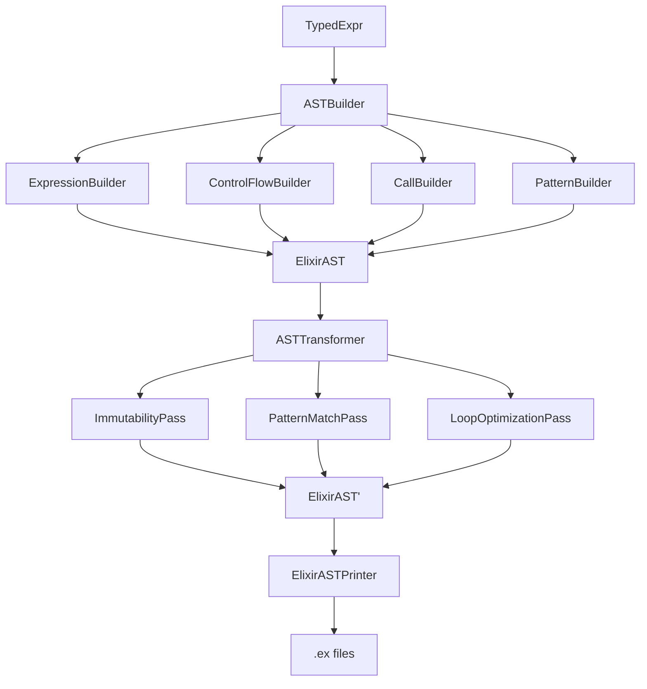

# AST Pipeline Modularization - Product Requirements Document

**Date**: September 15, 2025
**Author**: Architecture Analysis
**Status**: Analysis Complete
**Priority**: Critical - Blocking Maintainability

## Executive Summary

The Reflaxe.Elixir compiler's AST pipeline has grown to unsustainable sizes, with ElixirASTBuilder.hx at 8,444 lines and ElixirASTTransformer.hx at 5,534 lines. This monolithic architecture is causing repeated bugs, making maintenance difficult, and preventing effective development. This PRD outlines a comprehensive modularization strategy to break these files into manageable, single-responsibility modules.

## Current State Analysis

### File Size Crisis
```
src/reflaxe/elixir/ast/
├── ElixirASTBuilder.hx      # 8,444 lines (410 case statements) ❌
├── ElixirASTTransformer.hx  # 5,534 lines (325 case statements) ❌
├── ElixirASTPrinter.hx      # 1,340 lines ✅
├── ElixirAST.hx             # 953 lines ✅
└── builders/                # Previous modularization attempt (incomplete)
    ├── BinaryOpBuilder.hx   # Partial extraction
    └── CoreExprBuilder.hx   # Partial extraction
```

### Architectural Assessment

#### ✅ What's Working Well
1. **GenericCompiler Implementation**: ElixirCompiler properly extends `GenericCompiler<ElixirAST, ElixirAST, ElixirAST, ElixirAST, ElixirAST>`
2. **Pure AST Pipeline**: Successfully migrated from 75 helper files to AST-based architecture
3. **Clear Pipeline Phases**: TypedExpr → Builder → Transformer → Printer
4. **ElixirASTPrinter**: At 1,340 lines, reasonably sized and focused

#### ❌ Critical Problems
1. **Monolithic Files**: 8,444 lines in builder, 5,534 lines in transformer
2. **Mixed Responsibilities**: Builder contains transformation logic, transformer contains building logic
3. **Unmaintainable Complexity**: 410 TypedExpr cases in one file, 325 AST cases in another
4. **Whack-a-Mole Bugs**: Fixes in one area break others due to tangled dependencies
5. **No Clear Separation**: Functions doing multiple things, violating single responsibility

## Root Cause Analysis

### Why Did This Happen?

1. **Organic Growth**: Features added incrementally without refactoring
2. **Migration Debt**: When migrating from 75 helpers to AST, everything consolidated into 2 files
3. **Lack of Boundaries**: No clear module boundaries established during migration
4. **Pattern Accumulation**: 410 case statements handling every possible TypedExpr pattern
5. **Transformation Complexity**: 93 functions in builder alone, many over 100 lines

### Impact on Development

- **Bug Fix Time**: Simple fixes take hours due to file navigation
- **Regression Risk**: High - changes affect unpredictable areas
- **Testing Difficulty**: Can't test modules in isolation
- **Onboarding Barrier**: New developers overwhelmed by file size
- **Mental Model**: Impossible to hold entire system in mind

## Proposed Architecture

### Design Principles

1. **Single Responsibility**: Each module handles ONE aspect of compilation
2. **Clear Interfaces**: Well-defined contracts between modules
3. **Dependency Injection**: Modules receive dependencies, don't create them
4. **Testability**: Each module independently testable
5. **File Size Limits**: 500 lines ideal, 1,000 maximum, 2,000 absolute maximum

### Module Structure

```
src/reflaxe/elixir/ast/
├── ElixirAST.hx                    # AST type definitions (existing)
├── ElixirASTContext.hx             # Shared compilation context (NEW)
├── builder/                        # TypedExpr → ElixirAST conversion
│   ├── ASTBuilder.hx               # Main coordinator (<500 lines)
│   ├── ExpressionBuilder.hx        # Basic expressions (TConst, TVar, etc.)
│   ├── ControlFlowBuilder.hx       # If, switch, while, for
│   ├── CallBuilder.hx              # Function/method calls
│   ├── PatternBuilder.hx          # Pattern matching construction
│   ├── ClassBuilder.hx            # Class/module building
│   ├── EnumBuilder.hx              # Enum handling
│   ├── FieldAccessBuilder.hx      # Field access patterns
│   ├── OperatorBuilder.hx         # Binary/unary operators
│   ├── ArrayBuilder.hx            # Array operations
│   ├── LambdaBuilder.hx           # Function expressions
│   ├── MetadataExtractor.hx       # Extract metadata from TypedExpr
│   └── VariableTracker.hx         # Variable naming/tracking
├── transformer/                    # ElixirAST → ElixirAST transformations
│   ├── ASTTransformer.hx          # Main coordinator (<500 lines)
│   ├── passes/                    # Transformation passes
│   │   ├── ImmutabilityPass.hx   # Mutation → rebinding
│   │   ├── PatternMatchPass.hx   # Optimize patterns
│   │   ├── IdiomaticEnumPass.hx  # Enum idioms
│   │   ├── LoopOptimizationPass.hx # While → Enum operations
│   │   ├── HygienePass.hx        # Variable hygiene
│   │   ├── InlineExpansionPass.hx # Inline functions
│   │   ├── AssignmentExtractionPass.hx # Extract assignments
│   │   ├── StructUpdatePass.hx   # Struct update optimization
│   │   ├── OTPChildSpecPass.hx   # OTP patterns
│   │   ├── SchemaTransformPass.hx # @:schema handling
│   │   ├── LiveViewTransformPass.hx # @:liveview handling
│   │   └── CleanupPass.hx        # Final cleanup
│   └── utils/                     # Transformation utilities
│       ├── PatternAnalyzer.hx    # Analyze patterns
│       ├── VariableUsageAnalyzer.hx # Track usage
│       └── ASTWalker.hx          # AST traversal utilities
└── printer/                       # ElixirAST → String
    └── ElixirASTPrinter.hx        # Existing, already good size

```

### Module Interactions



## Implementation Strategy

### Phase 1: Prepare Infrastructure (Week 1)

1. **Create ElixirASTContext.hx**
   - Shared state for compilation
   - Variable mappings
   - Metadata storage
   - Dependency tracking

2. **Create base builder/transformer interfaces**
   - Define contracts between modules
   - Establish naming conventions
   - Set up dependency injection

3. **Set up test infrastructure**
   - Unit tests for each new module
   - Integration tests for pipeline
   - Regression test suite

### Phase 2: Extract Expression Builders (Week 2)

**Start with the simplest, most independent builders:**

1. **ExpressionBuilder.hx** (~400 lines)
   - TConst → literals
   - TVar → variables
   - TLocal → local references
   - TIdent → identifiers

2. **OperatorBuilder.hx** (~300 lines)
   - TBinop → binary operations
   - TUnop → unary operations
   - String concatenation detection

3. **FieldAccessBuilder.hx** (~400 lines)
   - TField → field access
   - FAnon, FInstance, FStatic handling
   - Method resolution

**Testing**: Each extraction followed by full test suite run

### Phase 3: Extract Control Flow Builders (Week 3)

1. **ControlFlowBuilder.hx** (~500 lines)
   - TIf → if/else
   - TWhile → while loops
   - TFor → for loops
   - TBreak, TContinue

2. **PatternBuilder.hx** (~600 lines)
   - TSwitch → case statements
   - Pattern extraction
   - Enum patterns
   - Array patterns

3. **CallBuilder.hx** (~500 lines)
   - TCall → function calls
   - Method dispatch
   - Abstract type handling
   - Constructor calls

### Phase 4: Extract Complex Builders (Week 4)

1. **ClassBuilder.hx** (~800 lines)
   - Class → module conversion
   - Field compilation
   - Method compilation
   - Constructor handling

2. **EnumBuilder.hx** (~400 lines)
   - Enum → tagged tuples
   - Pattern generation
   - Constructor functions

3. **LambdaBuilder.hx** (~300 lines)
   - TFunction → anonymous functions
   - Closure handling
   - Variable capture

### Phase 5: Extract Transformation Passes (Week 5-6)

**Extract existing transformation logic into discrete passes:**

1. **Core passes** (Week 5)
   - ImmutabilityPass
   - PatternMatchPass
   - LoopOptimizationPass
   - HygienePass

2. **Annotation passes** (Week 6)
   - SchemaTransformPass
   - LiveViewTransformPass
   - OTPChildSpecPass
   - RouterTransformPass

### Phase 6: Integration and Cleanup (Week 7)

1. **Wire everything together**
   - Update ASTBuilder to use new modules
   - Update ASTTransformer to use passes
   - Ensure proper coordination

2. **Delete old monolithic files**
   - Remove old ElixirASTBuilder.hx
   - Remove old ElixirASTTransformer.hx
   - Clean up dead code

3. **Documentation update**
   - Update architecture docs
   - Create module documentation
   - Update CLAUDE.md files

## Success Metrics

### Quantitative Metrics
- [ ] No file exceeds 1,000 lines (stretch: 500 lines)
- [ ] Total line count reduced by 20%+ through deduplication
- [ ] All tests pass
- [ ] Todo-app compiles and runs
- [ ] Performance within 10% of current

### Qualitative Metrics
- [ ] Clear single responsibility per module
- [ ] Easy to find where to make changes
- [ ] New features don't require modifying core builders
- [ ] Bug fixes are localized to single modules
- [ ] Developers can understand modules in isolation

## Risk Mitigation

### Identified Risks

1. **Regression Risk**: Breaking existing functionality
   - **Mitigation**: Incremental extraction, test after each step

2. **Performance Risk**: Modularization overhead
   - **Mitigation**: Profile before/after, optimize hot paths

3. **Integration Risk**: Modules not working together
   - **Mitigation**: Define clear interfaces upfront

4. **Scope Creep**: Trying to fix everything at once
   - **Mitigation**: Strict phase boundaries, feature freeze during refactor

## Documentation Cleanup

### Files to Update
- Remove references to "pre-AST" architecture
- Update AST_PIPELINE_MIGRATION.md with new structure
- Remove mentions of deleted helper files
- Update compiler development guides

### Files to Delete
- Outdated migration plans
- References to string-based compilation
- Documentation of removed helper pattern

## Timeline

**Total Duration**: 7 weeks

- Week 1: Infrastructure setup
- Week 2: Expression builders
- Week 3: Control flow builders
- Week 4: Complex builders
- Week 5-6: Transformation passes
- Week 7: Integration and cleanup

## Validation Criteria

Before considering this complete:

1. **All tests pass**: `npm test` succeeds
2. **Todo-app works**: Full compilation and runtime
3. **File sizes acceptable**: All under 1,000 lines
4. **Documentation updated**: No outdated references
5. **Performance acceptable**: Within 10% of baseline
6. **Code review passed**: Architecture approved

## Alternative Approaches Considered

### Option 1: Gradual Refactoring
- **Pros**: Lower risk, can be done alongside features
- **Cons**: Takes much longer, technical debt accumulates
- **Decision**: Rejected - need focused effort to fix properly

### Option 2: Complete Rewrite
- **Pros**: Clean slate, perfect architecture
- **Cons**: High risk, would take months, lose bug fixes
- **Decision**: Rejected - too risky and time-consuming

### Option 3: Functional Decomposition (Chosen)
- **Pros**: Manageable scope, clear boundaries, testable
- **Cons**: Requires careful planning, temporary disruption
- **Decision**: Selected - best balance of risk and reward

## Conclusion

The current monolithic AST builder and transformer are unsustainable and must be modularized. This PRD provides a clear, actionable plan to decompose these files into manageable, single-responsibility modules while maintaining all functionality. The phased approach minimizes risk while ensuring steady progress toward a maintainable architecture.

## Appendix: Current Function Distribution

### ElixirASTBuilder.hx Analysis
- 93 total functions
- 410 TypedExpr case statements
- Average function length: ~90 lines
- Longest function: >300 lines
- Mixed responsibilities throughout

### ElixirASTTransformer.hx Analysis
- 325 ElixirAST case statements
- Multiple transformation passes interleaved
- No clear separation between passes
- Side effects throughout

### Target State
- No module >1,000 lines
- Average function length: <30 lines
- Clear single responsibility
- Testable in isolation
- Documented interfaces